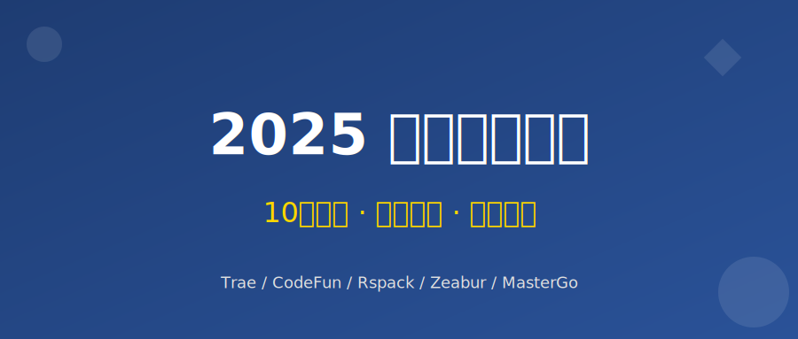

# 效率翻倍！前端开发者2025年必备的10个“提效神器”与使用秘籍

> 你是否也经历过：反复切图量尺寸？手动比对代码差异？在无数个组件库中挑花眼？今天，我整理了10个让我个人开发效率飙升的工具，有些甚至能帮你省下数小时的重复劳动。

工具推荐类文章旨在为你提供即时的正反馈，解决开发流程中最令人头疼的环节。它们涵盖了从设计、开发、调试到部署的全流程，不仅是单纯的辅助，更是 2025 年前端开发者的“必备武器库”。

---

## 🎨 一、 设计与协作：打破视觉与代码的壁垒

### 1. MasterGo / 即时设计 (国产在线协作设计)
* **核心解决痛点**：Figma 网络不稳定，汉化不全，团队协作有门槛。
* **“秘籍”级技巧**：**海量本土资源库与 Dev 模式**
  相比 Figma，国产工具 MasterGo 和即时设计在国内访问速度极快。利用它们的“Dev 模式”，不仅能查看 CSS，还能直接查看 iOS/Android/小程序 的原生代码。更重要的是，它们的社区资源库中有大量符合国内 UI 规范的组件（如 Ant Design、TDesign、WeUI），一键复用，效率倍增。

### 2. CodeFun (国产设计稿转代码神器)
* **核心解决痛点**：从设计稿到生产级 React/Vue/小程序代码的转换极其繁琐。
* **“秘籍”级技巧**：**一键生成多端代码（含小程序）**
  CodeFun 是专为国内开发者打造的“设计图转代码”工具。上传 Sketch/Figma/MasterGo 设计稿，它能智能识别列表、网格布局，并直接生成 Vue、React、**Taro、Uni-app** 等多端代码。最强的是它对**微信小程序**的原生支持，生成的代码结构清晰，甚至连 `rpx` 转换都帮你做好了。

---

## 🐛 二、 开发与调试：精准定位，告别盲猜

### 3. Eruda (移动端 H5 调试神器)
* **核心解决痛点**：移动端 H5 页面报错无法查看控制台，改 Bug 全靠 `alert` 和盲猜。
* **“秘籍”级技巧**：**如何用这个工具远程调试真机上的H5页面，并抓取网络请求？**
  在开发环境配置中通过 Vite 插件动态注入 Eruda。最狠的一招：**拦截并重发网络请求**。在真机上测试时，如果接口数据异常，直接在手机页面的 Eruda Network 面板上修改参数并重发请求，或者将响应JSON修改成异常状态，无需电脑重现就能直接调试异常 UI！

### 4. Requestly (网络请求修改利器)
* **核心解决痛点**：本地开发时频繁切换接口环境，或者遭遇跨域问题。
* **“秘籍”级技巧**：**生产环境 Bug 本地秒复现**
  线上出现了只有特定环境才会复现的 Bug？用 Requestly 的 Map Local 功能，直接拦截线上环境的 JS 静态资源请求，将其映射到你本地的 `localhost:5173/main.js`。无需部署，你在本地改代码，线上环境页面立刻生效！

---

## 🚀 三、 代码质量与效率：AI 结对编程

### 5. Trae / Cursor (新一代 AI 代码编辑器)
* **核心解决痛点**：总是要写重复的样板代码、代码质量参差不齐，AI 响应慢。
* **“秘籍”级技巧**：**Context 深度理解与中文友好**
  Trae 是字节跳动推出的新一代 AI IDE，完美兼容 VS Code 插件生态。它集成了 Claude 3.5 Sonnet 等顶级模型，且**完全免费**（目前）。相比 Cursor，Trae 在中文语境理解和国内网络环境下表现更优。使用 `Cmd+I` (Mac) 唤起 AI，直接让它“阅读当前目录下的所有 utils 文件并重构 api.ts”，体验飞一般的速度。

### 6. Raycast (Mac 生产力聚合台) + Snippets
* **核心解决痛点**：频繁在浏览器、终端、编辑器之间切换；常用的代码片段到处乱丢。
* **“秘籍”级技巧**：**变量化的动态代码片段**
  将常用的 API 封装模板存为 Raycast Snippet，并使用 `{cursor}` 或 `{placeholder}` 变量。当输入关键词触发片段后，光标会自动跳转到你需要填入接口地址的地方，彻底告别来回复制粘贴。

---

## ⚡ 四、 构建与部署：唯快不破

### 7. Rspack (基于 Rust 的高性能构建工具)
* **核心解决痛点**：项目变大后，构建慢、热更新（HMR）慢如爬虫，严重打断思路。
* **“秘籍”级技巧**：**如何用这个工具将 Vue 项目的构建速度提升 30% 以上？**
  如果你的 Webpack 项目龟速，尝试一键平滑迁移至 Rsbuild/Rspack。这是字节跳动开源的构建工具，兼容 Webpack 生态。大部分项目只需替换配置文件，热更新速度就能从过去的 10 秒以上断崖式降至 1 秒以内，真正做到所见即所得。

### 8. Zeabur / 腾讯云 Webify (国内高速部署)
* **核心解决痛点**：Vercel/Netlify 国内访问慢甚至被墙，自建服务器运维成本高。
* **“秘籍”级技巧**：**傻瓜式部署与按量付费**
  Zeabur 是一款体验极佳的部署平台（支持阿里云/华为云节点），不仅支持静态网站，还能一键部署 Node.js/Go/Docker 应用。如果追求极致的国内访问速度和微信生态集成，推荐**腾讯云 Webify**，支持从 GitHub/Gitee 仓库自动拉取构建，配合 CDN 加速，让你的应用在国内秒开。

---

## 📈 五、 性能与监控：防患于未然

### 9. Web Vitals (核心 Web 指标扩展)
* **核心解决痛点**：性能问题往往在线上被投诉时才发现，影响留存和 SEO。
* **“秘籍”级技巧**：**如何在开发阶段就实时监控并预警 LCP、CLS 等关键性能指标？**
  配置 Web Vitals 开启 HUD（抬头显示器）覆盖层，让页面在本地开发时就实时显示 LCP（最大内容绘制）、CLS（累积布局偏移）等。团队可自律性规定：HUD没变绿，功能不上线，将性能优化直接前置。

### 10. Fundebug / Sentry (异常追踪与性能监控平台)
* **核心解决痛点**：前端线上报错毫无头绪，用户描述的复现路径形同玄学。
* **“秘籍”级技巧**：**录屏回放与数据合规**
  Sentry 功能强大但服务器在海外，数据回传有时延且存在合规风险。国内推荐使用 **Fundebug**。它同样支持 SourceMap 定位和**用户行为录屏**（Replay），能完整复现用户点击路径。更重要的是，数据存储在国内，符合企业数据安全合规要求，且对微信小程序的报错监控支持得更好。

---

## 💎 特别板块：一个私藏技巧

**突破 Console.log 的极限：`console.table` 与 `console.group`**

这是一个日常开发极度实用却被轻易忽视的技巧。面对复杂列表后端返回的长数据，别再用它叠罗汉了！
* 试试 `console.table(res.data.list)`：控制台会将其完美输出为带表头、可排序的表格，排查某个字段值一目了然！
* 试试 `console.groupCollapsed('初始化耗时统计')`：配合 `console.time()` 打印一组信息后，将它们收拢在一个独立的折叠组中，还你一个高大上且极其有条理的控制台界面。

---

## 💬 结语

以上工具，**哪个对你帮助最大？或者你也有压箱底的效率神器？** 

欢迎在评论区分享交流，**点赞最高的前 3 位朋友，我会私信发送一份更详细的《前端工具链配置与性能优化清单》**（包含部分工具可以直接复用的配置文件）。

> *我是一名专注于通过技术提效助力产品成功的前端开发者，偶尔分享项目实战与商业思考。欢迎关注，一起交流。*
