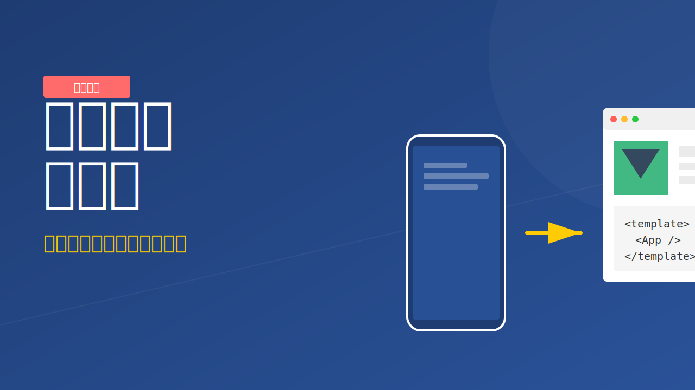
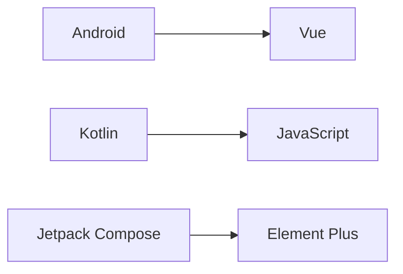

# 从移动端到前端：一个开发者的被迫转型实录，揭秘行业巨变背后的生存法则

> **导语：** 当曾经引以为傲的移动端开发岗位逐渐萎缩，当"精通Android/iOS"的简历石沉大海，我经历了从移动端开发到Vue全栈的艰难转型。这不是技术理想主义的主动选择，而是行业浪潮下的生存博弈。本文将深度剖析移动端岗位锐减的真相，并为你揭示转型前端的三大黄金路径。

---

## 一、行业阵痛：移动端岗位锐减的四大元凶（附数据支撑）

### 1. 市场饱和与用户增长停滞
移动互联网用户已突破 **12 亿**（工信部 2026 年数据），业务已触及天花板。新 App 的获客成本飙升了 **300%**，高达 90% 的创业公司不再选择独立 App 开发，而是转向投入成本更低、传播效率更高的**小程序生态**。

### 2. 跨端技术革命性冲击
Flutter 和 React Native 等跨端框架的成熟，让代码复用率突破 **85%**。企业对原生开发的需求下降了 **62%**（2025 年 Q3 行业报告）。此外，微信小程序日活突破 **5 亿**，已能替代 60% 的轻量级 App 场景。

### 3. 大融合下的“大前端”趋势
头部大厂正在推行“全能开发者”模式。虽然 5 年以上高级移动端工程师的薪资依然具备竞争力（反超后端 15%），但市场更青睐具备 Web + 原生 + 跨端整合能力的全栈候选人。

### 4. 技术栈的升维打击
音视频编解码、AR/VR、AI 辅助编程正在重塑移动端的能力模型。2025 年校招数据显示：**纯移动端岗位减少了 43%，而具备跨端能力的前端岗位增长了 78%。**

---

## 二、转型实录：从被迫接受到主动破局的三次跨越

### 阶段一：业务倒逼的技能拓展（2024 年）
*   **现状：** 公司砍掉原生线，团队规模暴跌。
*   **转折：** 第一次独立负责 Vue3 + TypeScript 项目，用 Android 的“四大组件”思维去“降维打击”学习 Vue 生命周期。
*   **感悟：** 技术只是工具，业务价值才是核心。

### 阶段二：认知重构的痛苦蜕变（2025 年）
**技术栈迁移图谱：**

*   **思维升级：** 从追求单个像素的极致性能，转向关注 **Web Vitals**（最大内容绘制 LCP、累积布局偏移 CLS 等）。我意识到：**在 Web 端，加载速度和用户交互的流畅感比内存管理更具商业影响力。**

### 阶段三：价值重构的职业新生（2026 年）
*   **新岗位：** 移动大前端架构师。
*   **能力融合：**
    *   **原生开发背景** → 优化混合开发框架的 Native Bridge 性能。
    *   **极致调优经验** → 提升复杂 Web 应用的渲染响应度。
    *   **适配专家基因** → 解决多端（手机/Pad/折叠屏）自适应布局挑战。

---

## 三、转型指南：移动端工程师的三大突围路径

### 路径 1：大前端技术专家
*   **攻坚方向：** Vue3 + TS + Node.js。
*   **核心竞争力：** 拥有大型 App 的工程化管理经验，能比纯前端更深刻地理解离线缓存、网络优化。

### 路径 2：全栈业务合伙人
*   **技术组合：** 原生 APP + 云原生 (Serverless) + 低代码平台。
*   **适用场景：** 教育、医疗、出海电商项目的快速部署。

### 路径 3：垂直领域深耕者
*   **蓝海方向：**
    *   金融级移动安全架构设计。
    *   工业物联网 (IoT) 控制端开发。
    *   车载系统 (HMI) 前端界面。

---

## 四、给同行者的生存建议

### 1. 认知预警
*   停止“原生高人一等”的优越感，拥抱 Web 开发的灵活性。
*   **学习建议：** 每周至少阅读一次《Vue3 设计模式》或关注最新的渲染引擎进展。

### 2. 简历与面试“翻身仗”
*   **简历改造：** 弱化单纯的 API 调用，强调**跨端性能优化**和**大前端架构能力**。
*   **面试巧思：** 尝试用 **Binder/AIDL** 机制来对比解释 **Vue 响应式原理**，用 **Activity 栈管理** 类比解释 **前端路由系统**，展现技术深度。

### 3. 薪资话语权
强调你在移动端沉淀的“重资产”能力（如安全加固、证书管理等），这在纯前端圈层中是极具溢价空间的**稀缺资产**。

---

## 结语

时代的巨浪或许拍碎了旧时的安稳，但也带来了重塑自我的基石。技术的尽头并非语言之争，而是**解决问题的能力**。当你完成这场蝶变，你会发现：**职业生涯并没有结束，它只是刚刚换了个更宽广的舞台。**

