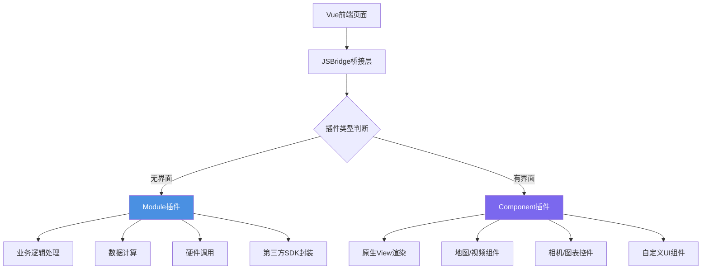
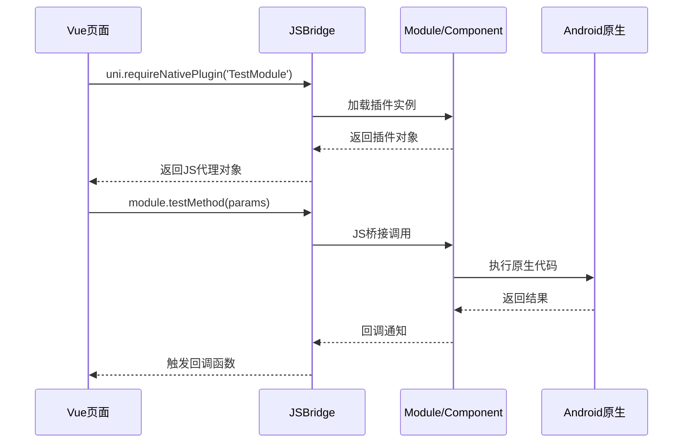

# 安卓与 UniApp 原生插件开发与混合工程大纲

> **核心价值：** 当 UniApp 官方 API 无法满足特殊的硬件通讯或者底层业务逻辑时，我们不可避免地要进行原生插件开发。本系列从零开始手把手教你在 Android 侧扩展 UniApp 的业务能力，并提供一整套包含 Module 原理的跑通 Demo。

## 🎯 系列教程导读

UniApp 因其"一次编写、多端发布"的特性，在国内有着大量的受众群体，特别是在做低成本交付、多端上线的小程序开发厂商中广受欢迎。这带来了一套刚需：如何打通底层硬件（如蓝牙打印机、定制硬件传感器）、调用第三方原生 SDK 以及补充缺失的 UI 行为？开发一套 UniApp 的 Android 插件成为了最硬核的保底武器。

---

## 📚 前置知识（非必须，但建议了解）

> **提示**：如果你已经有Java和Android基础，可以跳过本节直接进入第一章。

### Java基础（2小时速成）
*   类与对象的基本概念
*   方法定义与调用
*   异常处理机制
*   常用集合（List、Map）

### Android基础（2小时速成）
*   Activity生命周期
*   权限申请机制
*   常用UI组件（View、Button、TextView等）
*   Intent与Bundle基本用法

### 学习资源推荐
*   **Java入门视频**：B站搜索"Java零基础入门"
*   **Android基础教程**：[Android官方文档](https://developer.android.com/)
*   **在线练习平台**：LeetCode简单题

---

## 📖 学习路径图

本系列采用**3阶段渐进式学习**模式，适合不同基础的学习者：

```
阶段一：零基础入门（第1-5章，1-2周）
├── 目标：让完全小白能跑通第一个插件
├── 特点：零配置体验、极简示例、快速上手
└── 适合：没有原生开发经验的UniApp开发者

阶段二：核心能力构建（第6-10章，3-4周）
├── 目标：掌握Module和Component开发
├── 特点：本地环境、完整示例、逐步深入
└── 适合：有基础想深入学习原生插件开发的开发者

阶段三：实战与进阶（第11-15章，4-6周）
├── 目标：完成真实项目，解决实际问题
├── 特点：企业案例、性能优化、发布上线
└── 适合：需要集成第三方SDK、硬件设备的企业开发者
```

---

## 📚 教程大纲

---

## 阶段一：零基础入门

### 第1章：零配置体验5种原生插件功能 - 扫码、震动、定位、分享、通知，5分钟快速上手

> **学习目标**：不写一行代码，体验原生插件的强大

#### 1.1 预配置Demo下载
*   **完整项目下载**：GitHub仓库地址（包含已编译的AAR文件）
*   **项目结构说明**：Android原生工程 + UniApp前端工程
*   **快速运行步骤**：
    - 下载项目压缩包
    - 解压到本地目录
    - Android Studio打开原生工程
    - HBuilderX打开前端工程
    - 真机运行查看效果

#### 1.2 插件能做什么？（场景展示）
*   **扫码演示**：调用原生相机扫码，识别二维码
*   **震动演示**：调用原生震动API，实现触觉反馈
*   **定位演示**：获取GPS位置，实时更新坐标
*   **分享演示**：调用原生分享面板，分享到微信/QQ
*   **通知演示**：发送原生通知消息，点击跳转页面

#### 1.3 学习路线图预览
*   展示完整学习路径（从入门到精通）
*   标注当前位置（你现在在这里）
*   设置学习预期（每章需要多长时间）
*   明确学习目标（学完后能做什么）

#### 🚨 本章避坑指南

**常见错误Top 5**：

1. **Demo无法运行**
   - **原因**：Android Studio版本过旧或Gradle版本不匹配
   - **解决方案**：更新Android Studio到最新稳定版
   - **预防措施**：查看项目README中的环境要求

2. **真机无法连接**
   - **原因**：USB调试未开启或驱动未安装
   - **解决方案**：手机开启开发者选项和USB调试
   - **预防措施**：安装手机厂商官方驱动

3. **HBuilderX无法识别设备**
   - **原因**：ADB服务未启动
   - **解决方案**：运行`adb devices`检查设备连接
   - **预防措施**：重启HBuilderX或重新插拔USB

4. **插件功能无响应**
   - **原因**：权限未授予
   - **解决方案**：在手机设置中授予应用必要权限
   - **预防措施**：查看AndroidManifest.xml中的权限声明

5. **云打包失败**
   - **原因**：DCloud账户未登录或证书配置错误
   - **解决方案**：登录DCloud账户，检查证书配置
   - **预防措施**：使用本地打包作为备选方案

**最佳实践Checklist**：
- [ ] 已安装最新版Android Studio
- [ ] 已安装最新版HBuilderX
- [ ] 手机已开启开发者选项和USB调试
- [ ] 已成功运行至少一个演示功能
- [ ] 已了解学习路线图和预期时间

---

### 第2章：从零搭建完整的开发环境 - JDK、Android Studio、HBuilderX保姆级配置教程

> **学习目标**：从零搭建完整的开发环境，确保每一步都可验证

#### 2.1 前置要求
*   **电脑配置要求**：
    - Windows 10/11 或 macOS 10.14+
    - 内存至少8GB（推荐16GB）
    - 硬盘空间至少20GB可用
*   **网络环境要求**：
    - 能访问Google（Gradle依赖下载）
    - 如无法访问，需要配置国内镜像
*   **时间投入预期**：首次搭建需要2-3小时

#### 2.2 Windows用户安装步骤

**步骤1：JDK安装与配置**
*   下载JDK 11或17（推荐LTS版本）
*   配置JAVA_HOME环境变量
*   验证命令：`java -version`

**步骤2：Android Studio安装**
*   下载最新版Android Studio
*   安装Android SDK（自动下载）
*   配置ANDROID_HOME环境变量
*   国内镜像配置（阿里云镜像）

**步骤3：HBuilderX安装与配置**
*   下载HBuilderX标准版或App开发版
*   安装必要插件（uni-app编译器、App运行插件）
*   配置DCloud账户

**步骤4：环境验证**
*   运行测试项目验证环境
*   使用诊断脚本自动检测环境

#### 2.3 Mac用户安装步骤

**步骤1：Homebrew安装**
*   安装Homebrew包管理器
*   配置国内镜像加速

**步骤2：JDK安装（Apple Silicon适配）**
*   使用Homebrew安装JDK
*   配置环境变量

**步骤3：Android Studio安装**
*   下载并安装Android Studio
*   配置Android SDK路径
*   权限配置（安全性设置）

**步骤4：HBuilderX安装**
*   下载Mac版HBuilderX
*   拖拽到Applications文件夹

#### 2.4 常见问题速查表

| 问题现象 | 原因分析 | 解决方案 |
|:---|:---|:---|
| Gradle下载慢 | 国内网络环境限制 | 配置阿里云镜像 |
| SDK版本冲突 | 多个版本并存 | 统一SDK版本 |
| 模拟器卡顿 | HAXM未安装或未开启 | 安装Intel HAXM |
| 真机连接失败 | 驱动未安装 | 安装手机厂商驱动 |
| 编译报错 | Gradle版本不匹配 | 查看项目要求版本 |

#### 2.5 自动诊断脚本
*   提供Windows和Mac版本的诊断脚本
*   自动检测JDK、Android SDK、HBuilderX是否正确安装
*   输出详细的环境信息报告

#### 🚨 本章避坑指南

**常见错误Top 5**：

1. **JAVA_HOME未配置**
   - **原因**：安装JDK后未配置环境变量
   - **解决方案**：系统属性→高级→环境变量→新建JAVA_HOME
   - **预防措施**：使用诊断脚本验证

2. **Gradle下载超时**
   - **原因**：无法访问Google服务器
   - **解决方案**：配置阿里云镜像或使用VPN
   - **预防措施**：提前下载Gradle离线包

3. **Android SDK下载失败**
   - **原因**：网络问题或SDK服务器不可用
   - **解决方案**：使用国内镜像或离线SDK包
   - **预防措施**：检查网络连接，使用代理

4. **HBuilderX插件安装失败**
   - **原因**：网络问题或插件市场不可用
   - **解决方案**：手动下载插件包安装
   - **预防措施**：使用HBuilderX内置插件市场

5. **真机调试无法连接**
   - **原因**：ADB服务未启动或端口被占用
   - **解决方案**：重启ADB服务或重启电脑
   - **预防措施**：检查5037端口是否被占用

**性能陷阱**：
- ❌ 不要使用过旧的Android Studio版本（编译速度慢）
- ❌ 不要在C盘创建项目（磁盘IO影响性能）
- ❌ 不要同时打开过多项目（内存占用过高）

**最佳实践Checklist**：
- [ ] JDK已正确安装并配置JAVA_HOME
- [ ] Android Studio已安装并下载必要SDK
- [ ] ANDROID_HOME已正确配置
- [ ] HBuilderX已安装必要插件
- [ ] 诊断脚本运行结果全部通过
- [ ] 已成功创建并运行一个测试项目

---

### 第3章：先学会调试再写代码 - 日志查看、断点调试、错误排查3大核心技巧

> **学习目标**：掌握调试工具和技巧，快速定位问题

#### 3.1 为什么先学调试？
*   **现实情况**：写代码10分钟，调试2小时是常态
*   **学习必要性**：先学会看日志，才能定位问题
*   **避免挫败感**：快速解决环境问题，不在配置上浪费时间

#### 3.2 日志查看三板斧

**方法1：HBuilderX控制台日志**
*   打开HBuilderX控制台
*   查看console.log输出
*   过滤日志类型（info/warn/error）

**方法2：Android Studio Logcat**
*   打开Android Studio Logcat面板
*   过滤应用包名和日志级别
*   使用正则表达式过滤关键词

**方法3：浏览器远程调试**
*   Chrome DevTools远程调试
*   查看网络请求和Vue组件树
*   实时修改样式和调试JS代码

#### 3.3 常见错误速查

**错误1：插件未找到**
```
错误信息：Plugin not found: XXXModule
原因分析：package.json配置错误或AAR未正确放置
解决方案：检查nativeplugins目录结构和package.json配置
预防措施：使用标准目录结构模板
```

**错误2：方法不存在**
```
错误信息：Method not found: xxxMethod
原因分析：方法名拼写错误或未添加@UniJSMethod注解
解决方案：检查方法名和注解是否正确
预防措施：使用代码模板避免手写错误
```

**错误3：基座不匹配**
```
错误信息：基座版本不匹配
原因分析：使用标准基座调试原生插件
解决方案：重新打包自定义基座
预防措施：每次修改插件代码后重新打包基座
```

**错误4：权限被拒绝**
```
错误信息：Permission denied: xxx
原因分析：AndroidManifest.xml中未声明权限
解决方案：添加必要权限声明并动态申请
预防措施：查看官方文档权限要求
```

#### 3.4 调试技巧详解

**技巧1：如何添加日志输出**
*   Android端使用Log.d()、Log.e()等
*   UniApp端使用console.log()
*   使用统一的日志标签便于过滤

**技巧2：如何断点调试**
*   Android Studio中设置断点
*   Attach进程到调试器
*   查看变量值和调用栈

**技巧3：如何捕获异常**
*   使用try-catch包裹可能出错的代码
*   打印完整的异常堆栈信息
*   使用Crashlytics收集崩溃日志

#### 3.5 求助指南

**如何描述问题**（提供模板）：
```
【环境信息】
- 操作系统：Windows 11
- Android Studio版本：2024.1.1
- HBuilderX版本：3.8.0
- 测试机型：小米14，Android 14

【问题描述】
尝试调用原生插件时，提示"Plugin not found"

【已尝试的解决方案】
1. 检查了package.json配置
2. 重新打包了自定义基座
3. 清理了项目缓存

【相关代码】
const module = uni.requireNativePlugin('TestModule')

【错误日志】
[错误] Plugin not found: TestModule
```

**到哪里寻求帮助**：
*   DCloud社区：https://ask.dcloud.net.cn/
*   官方文档：https://nativesupport.dcloud.net.cn/
*   GitHub Issues：项目仓库的Issues页面
*   学习交流群：加入微信群或QQ群

#### 🚨 本章避坑指南

**常见错误Top 5**：

1. **日志输出太多找不到关键信息**
   - **原因**：未使用统一的日志标签
   - **解决方案**：使用TAG常量统一标签格式
   - **预防措施**：定义日志工具类统一管理

2. **断点调试无法触发**
   - **原因**：未正确Attach进程或断点位置错误
   - **解决方案**：确认进程已Attach，断点位置可达
   - **预防措施**：先验证代码是否执行到断点位置

3. **异常信息被吞掉了**
   - **原因**：catch块中未打印堆栈信息
   - **解决方案**：使用e.printStackTrace()输出完整堆栈
   - **预防措施**：统一异常处理框架

4. **不知道到哪里看日志**
   - **原因**：不了解多种查看日志的方式
   - **解决方案**：同时使用HBuilderX控制台和Logcat
   - **预防措施**：掌握三种日志查看方法

5. **问题描述不清导致没人回复**
   - **原因**：缺少环境信息和复现步骤
   - **解决方案**：使用问题模板完整描述
   - **预防措施**：提供最小可复现Demo

**性能陷阱**：
- ❌ 不要在生产代码中保留大量调试日志
- ❌ 不要在循环中打印日志（性能问题）
- ❌ 不要使用System.out.println（性能差）

**最佳实践Checklist**：
- [ ] 已掌握三种日志查看方法
- [ ] 已学会使用断点调试
- [ ] 已学会捕获和打印异常信息
- [ ] 已保存常见错误速查表
- [ ] 已加入学习交流群
- [ ] 已学会正确描述问题

---

### 第4章：30分钟开发第一个Module插件 - 从Hello World到Toast弹窗，极简示例快速上手

> **学习目标**：开发一个"Hello World"插件，点击按钮弹出原生Toast

#### 4.1 极简代码示例（50行以内）

**Android原生端（Java）**：
```java
// HelloModule.java - 极简版
package com.demo.plugin;

import io.dcloud.feature.uniapp.annotation.UniJSMethod;
import io.dcloud.feature.uniapp.common.UniModule;
import android.widget.Toast;

public class HelloModule extends UniModule {
    
    @UniJSMethod(uiThread = true)
    public void showHello(String name) {
        String message = "Hello, " + name + "! 来自原生Android";
        Toast.makeText(mUniSDKInstance.getContext(), message, Toast.LENGTH_SHORT).show();
    }
}
```

**UniApp前端端（Vue 3）**：
```vue
<!-- HelloDemo.vue - 极简版 -->
<template>
  <view class="container">
    <input v-model="userName" placeholder="请输入名字" />
    <button @click="sayHello">调用原生插件</button>
  </view>
</template>

<script setup>
import { ref } from 'vue'
const userName = ref('')

function sayHello() {
  const module = uni.requireNativePlugin('HelloModule')
  module.showHello(userName.value || '小白')
}
</script>
```

#### 4.2 分步骤教学

**步骤1：创建Module类**（5分钟）
*   在Android Studio中创建Java类
*   复制粘贴上面的代码
*   修改包名和类名

**步骤2：配置插件信息**（5分钟）
*   创建nativeplugins目录结构
*   编写package.json配置文件
*   配置插件ID和名称

**步骤3：编写前端代码**（5分钟）
*   在HBuilderX中创建Vue页面
*   复制粘贴前端代码
*   修改插件名称（与package.json一致）

**步骤4：打包测试**（10分钟）
*   使用HBuilderX云打包自定义基座
*   选择Android平台
*   等待打包完成（约3-5分钟）

**步骤5：真机运行**（5分钟）
*   连接真机
*   运行到自定义基座
*   测试功能是否正常

#### 4.3 每个步骤都有
*   **截图说明**：每个操作都有对应的截图
*   **常见错误提示**：列出每个步骤可能遇到的问题
*   **验证方法**：如何确认当前步骤成功

#### 4.4 扩展功能（可选）
*   添加返回值处理
*   添加异步回调
*   添加错误处理

#### 🚨 本章避坑指南

**常见错误Top 5**：

1. **找不到UniModule类**
   - **原因**：未正确导入UniApp SDK的AAR文件
   - **解决方案**：检查build.gradle中的依赖配置
   - **预防措施**：使用官方提供的SDK模板项目

2. **@UniJSMethod注解报错**
   - **原因**：SDK版本过旧不支持该注解
   - **解决方案**：更新到最新版UniApp SDK
   - **预防措施**：查看官方文档最低版本要求

3. **前端提示"插件未找到"**
   - **原因**：package.json配置错误或AAR未正确放置
   - **解决方案**：检查nativeplugins目录结构
   - **预防措施**：使用标准目录结构模板

4. **Toast不显示**
   - **原因**：不在UI线程调用或Context为null
   - **解决方案**：添加`uiThread = true`参数
   - **预防措施**：UI操作必须在主线程

5. **云打包失败**
   - **原因**：DCloud账户未登录或证书配置错误
   - **解决方案**：登录账户，检查证书配置
   - **预防措施**：提前准备好证书文件

**性能陷阱**：
- ❌ 不要在Module中执行耗时操作（会阻塞UI线程）
- ❌ 不要频繁创建Toast对象（使用单例模式）
- ❌ 不要在循环中调用原生方法（性能问题）

**最佳实践Checklist**：
- [ ] 已成功创建HelloModule类
- [ ] 已正确配置package.json
- [ ] 已成功打包自定义基座
- [ ] 已在真机上成功运行
- [ ] Toast消息正常显示
- [ ] 已理解@UniJSMethod注解的作用

---

### 第5章：一张图看懂插件工作原理 - Module vs Component、JSBridge流程、生命周期图解

> **学习目标**：不用懂代码也能明白插件是如何工作的

#### 5.1 Module vs Component 对比图



**Module插件特点**：
- ✅ 无界面，专注于业务逻辑
- ✅ 适合数据处理、硬件调用、SDK封装
- ✅ 使用`uni.requireNativePlugin()`调用

**Component插件特点**：
- ✅ 有原生View界面
- ✅ 适合地图、视频播放器、相机等UI组件
- ✅ 使用自定义标签`<native-component>`调用

#### 5.2 JS调用Native流程图



**关键步骤解析**：
1. **加载插件**：`requireNativePlugin`时加载插件类
2. **方法调用**：JS方法名映射到Java方法名
3. **参数传递**：JS对象转换为Java对象（JSON）
4. **执行代码**：在Android端执行原生代码
5. **返回结果**：Java对象转换为JS对象（JSON）

#### 5.3 插件生命周期图解


**生命周期阶段**：
1. **插件加载**：UniApp启动时加载插件类
2. **初始化**：调用`onCreate()`方法初始化资源
3. **激活运行**：响应前端调用，执行业务逻辑
4. **销毁**：调用`onDestroy()`方法释放资源

**常见错误点**：
- ❌ 忘记在`onDestroy()`中释放资源（内存泄漏）
- ❌ 在构造函数中执行耗时操作（启动慢）
- ❌ 未处理重复初始化（状态错乱）

#### 5.4 互动式学习

**在线流程模拟器**（建议）：
*   提供在线交互式演示
*   点击每个步骤查看详细说明
*   实时看到数据流向

#### 🚨 本章避坑指南

**常见误区Top 5**：

1. **混淆Module和Component的用途**
   - **误区**：所有功能都用Module实现
   - **正确做法**：无界面用Module，有界面用Component
   - **案例**：地图必须用Component，定位用Module

2. **不理解JSBridge的作用**
   - **误区**：以为可以直接调用Java方法
   - **正确理解**：JSBridge是中间翻译层，负责类型转换
   - **关键点**：JS和Java是两种不同的语言环境

3. **忽视生命周期管理**
   - **误区**：只关注功能实现，不管理资源
   - **后果**：内存泄漏、应用崩溃
   - **正确做法**：在onDestroy中释放资源

4. **参数传递混乱**
   - **误区**：直接传递复杂对象
   - **问题**：序列化失败、数据丢失
   - **正确做法**：使用简单的JSON对象，避免循环引用

5. **不理解同步和异步**
   - **误区**：所有方法都用同步调用
   - **后果**：阻塞UI线程、应用卡顿
   - **正确做法**：耗时操作使用异步回调

**性能陷阱**：
- ❌ 不要频繁加载插件（插件应该是单例）
- ❌ 不要在JSBridge层做复杂计算（效率低）
- ❌ 不要传递过大的JSON数据（序列化耗时）

**最佳实践Checklist**：
- [ ] 已理解Module和Component的区别
- [ ] 已理解JSBridge的工作原理
- [ ] 已理解插件生命周期
- [ ] 已理解同步和异步的区别
- [ ] 已理解参数传递的限制
- [ ] 已能在实际场景中选择合适的插件类型

---

## 阶段二：核心能力构建

### 第6章：Module插件开发实战 - 获取设备信息、震动反馈、异步回调完整示例

> **学习目标**：掌握Module插件的核心开发技能

#### 6.1 继承UniModule与生命周期
*   创建Module类的基本步骤
*   重写onCreate和onDestroy方法
*   管理Module生命周期状态

#### 6.2 @UniJSMethod注解详解
*   **同步方法**：`sync = true`，直接返回结果
*   **异步方法**：使用UniJSCallback回调
*   **线程控制**：`uiThread`参数的使用场景

#### 6.3 实战演练：设备信息Module
*   获取Android ID、设备型号、系统版本
*   封装为JSON对象返回前端
*   处理权限申请流程

#### 6.4 多个Module协作示例
*   主Module调用辅助Module
*   使用静态变量共享数据
*   避免循环依赖

#### 6.5 错误处理最佳实践
*   异常捕获机制
*   统一错误码设计
*   用户友好的错误提示

#### 🚨 本章避坑指南

**常见错误Top 5**：

1. **方法名与前端不匹配**
   - **原因**：拼写错误或大小写问题
   - **解决方案**：使用代码生成工具自动生成
   - **预防措施**：编写单元测试验证方法名

2. **参数类型不匹配**
   - **原因**：JS和Java类型不一致
   - **解决方案**：使用JSONObject统一接收参数
   - **预防措施**：参考官方类型映射表

3. **忘记添加@UniJSMethod注解**
   - **原因**：手写代码容易遗漏
   - **解决方案**：使用代码模板
   - **预防措施**：编译时检查所有public方法

4. **异步回调未处理**
   - **原因**：忘记调用callback.invoke()
   - **解决方案**：使用try-finally确保回调
   - **预防措施**：封装统一的回调工具类

5. **内存泄漏**
   - **原因**：持有Activity或Context引用
   - **解决方案**：使用WeakReference或ApplicationContext
   - **预防措施**：使用LeakCanary检测

**性能陷阱**：
- ❌ 不要在同步方法中执行耗时操作
- ❌ 不要在构造函数中初始化重量级资源
- ❌ 不要频繁创建Module实例（应该是单例）

**最佳实践Checklist**：
- [ ] 已掌握@UniJSMethod的三种用法
- [ ] 已完成设备信息Module实战
- [ ] 已实现统一的错误处理机制
- [ ] 已学会使用日志工具调试
- [ ] 已理解Module生命周期
- [ ] 已避免常见内存泄漏问题

---

### 第7章：Component插件开发实战 - 原生视频播放器组件，从布局到事件传递完整实现

> **学习目标**：掌握Component插件的核心开发技能

#### 7.1 继承UniComponent完整流程
*   创建Component类的基本步骤
*   实现initComponentHostView方法
*   返回自定义的原生View

#### 7.2 @UniComponentProp属性传递
*   定义组件属性
*   实现属性监听和更新
*   双向数据绑定实现

#### 7.3 完整示例：原生视频播放器
*   创建VideoView组件
*   实现播放、暂停、进度控制
*   处理横竖屏切换

#### 7.4 事件传递机制
*   使用fireEvent向前端发送事件
*   处理用户交互事件
*   实现自定义事件类型

#### 7.5 性能优化实践
*   View复用机制
*   异步加载资源
*   内存管理策略

#### 🚨 本章避坑指南

**常见错误Top 5**：

1. **View无法显示**
   - **原因**：未设置LayoutParam或尺寸为0
   - **解决方案**：设置明确的宽高或MATCH_PARENT
   - **预防措施**：使用布局预览工具检查

2. **属性不生效**
   - **原因**：@UniComponentProp方法名不匹配
   - **解决方案**：确保方法名为`set`+属性名（首字母大写）
   - **预防措施**：使用代码生成工具

3. **事件未触发**
   - **原因**：未调用fireEvent或事件名不匹配
   - **解决方案**：检查事件名拼写和触发时机
   - **预防措施**：使用常量定义事件名

4. **内存泄漏**
   - **原因**：View持有Activity引用
   - **解决方案**：使用getContext()获取上下文
   - **预防措施**：定期使用LeakCanary检测

5. **性能卡顿**
   - **原因**：在主线程执行耗时操作
   - **解决方案**：使用异步任务处理耗时操作
   - **预防措施**：使用性能分析工具检测

**性能陷阱**：
- ❌ 不要在onMeasure中执行复杂计算
- ❌ 不要频繁创建新的View对象
- ❌ 不要在绘制方法中创建对象

**最佳实践Checklist**：
- [ ] 已完成原生视频播放器组件
- [ ] 已掌握属性传递机制
- [ ] 已掌握事件传递机制
- [ ] 已实现性能优化
- [ ] 已避免常见内存泄漏
- [ ] 已测试横竖屏切换场景

---

### 第8章：事件通信与数据传递 - 全局事件、JSON传递、异步编程模式详解

> **学习目标**：掌握插件与前端的数据交互方式

#### 8.1 全局事件机制
*   使用plus.globalEvent发送和接收事件
*   实现发布-订阅模式
*   管理事件监听器

#### 8.2 数据传递方式
*   基本类型传递（String、Number、Boolean）
*   JSON对象传递
*   数组传递
*   二进制数据传递（限制）

#### 8.3 异步编程模式
*   回调函数模式
*   Promise封装
*   async/await使用

#### 8.4 实战演练：实时定位服务
*   后台Service获取位置信息
*   使用全局事件推送到前端
*   前端实时更新UI

#### 🚨 本章避坑指南

**常见错误Top 5**：

1. **事件未接收到**
   - **原因**：事件名不匹配或监听器未注册
   - **解决方案**：使用常量定义事件名
   - **预防措施**：统一事件管理中心

2. **数据传递丢失**
   - **原因**：JSON序列化失败或数据过大
   - **解决方案**：简化数据结构，分批传递
   - **预防措施**：限制单次传递数据大小

3. **回调地狱**
   - **原因**：多层嵌套回调
   - **解决方案**：使用Promise或async/await
   - **预防措施**：统一异步编程规范

4. **内存泄漏**
   - **原因**：忘记移除事件监听器
   - **解决方案**：在页面卸载时移除监听器
   - **预防措施**：使用once模式或自动清理

5. **线程安全问题**
   - **原因**：多线程访问共享数据
   - **解决方案**：使用同步锁或主线程切换
   - **预防措施**：避免跨线程直接访问

**性能陷阱**：
- ❌ 不要频繁发送事件（合并批量发送）
- ❌ 不要传递过大的JSON数据
- ❌ 不要在事件处理中执行耗时操作

**最佳实践Checklist**：
- [ ] 已掌握全局事件机制
- [ ] 已掌握数据传递方式
- [ ] 已完成实时定位服务实战
- [ ] 已避免常见内存泄漏
- [ ] 已使用Promise封装异步操作
- [ ] 已统一事件管理规范

---

### 第9章：设备功能调用实战 - 相机拍照、GPS定位、蓝牙扫描、传感器数据获取

> **学习目标**：掌握常用硬件功能的调用方式

#### 9.1 相机与相册
*   拍照功能实现
*   相册选择功能
*   图片压缩和裁剪

#### 9.2 定位服务
*   GPS定位原理
*   高精度定位vs网络定位
*   后台定位实现

#### 9.3 蓝牙功能
*   BLE设备扫描
*   设备连接与通信
*   数据读写操作

#### 9.4 传感器调用
*   加速度传感器
*   陀螺仪传感器
*   光线传感器

#### 🚨 本章避坑指南

**常见错误Top 5**：

1. **权限被拒绝**
   - **原因**：未动态申请权限或用户拒绝
   - **解决方案**：使用权限申请框架，引导用户授权
   - **预防措施**：提前在Manifest中声明权限

2. **相机无法打开**
   - **原因**：权限未授予或相机被占用
   - **解决方案**：检查权限并释放相机资源
   - **预防措施**：使用相机前检查权限

3. **定位失败**
   - **原因**：GPS信号弱或权限未授予
   - **解决方案**：使用混合定位（GPS+网络）
   - **预防措施**：提示用户到开阔区域

4. **蓝牙连接失败**
   - **原因**：蓝牙未开启或设备不支持BLE
   - **解决方案**：检查蓝牙状态并提示用户开启
   - **预防措施**：使用前检查蓝牙状态

5. **传感器数据异常**
   - **原因**：传感器校准问题或数据过滤不足
   - **解决方案**：添加数据校准和过滤算法
   - **预防措施**：参考官方传感器使用指南

**性能陷阱**：
- ❌ 不要频繁调用定位服务（耗电）
- ❌ 不要长时间保持蓝牙连接（耗电）
- ❌ 不要以最高频率读取传感器数据

**最佳实践Checklist**：
- [ ] 已掌握权限申请流程
- [ ] 已完成相机拍照功能
- [ ] 已完成定位服务功能
- [ ] 已完成蓝牙扫描功能
- [ ] 已测试多种机型兼容性
- [ ] 已优化耗电问题

---

### 第10章：本地数据存储与文件操作 - SharedPreferences、SQLite数据库、文件读写完整方案

> **学习目标**：掌握本地数据持久化方式

#### 10.1 SharedPreferences
*   轻量级键值对存储
*   适用场景：配置信息、用户偏好
*   读写性能优化

#### 10.2 SQLite数据库
*   数据库创建与升级
*   CRUD操作封装
*   事务处理机制

#### 10.3 文件读写操作
*   内部存储vs外部存储
*   文件读写权限
*   大文件处理策略

#### 10.4 实战演练：本地缓存系统
*   设计缓存策略
*   实现LRU缓存淘汰
*   缓存清理机制

#### 🚨 本章避坑指南

**常见错误Top 5**：

1. **数据存储失败**
   - **原因**：存储空间不足或权限未授予
   - **解决方案**：检查存储空间和权限
   - **预防措施**：提供存储空间检查接口

2. **数据库操作卡顿**
   - **原因**：在主线程执行数据库操作
   - **解决方案**：使用异步任务或线程池
   - **预防措施**：数据库操作必须在子线程

3. **文件读写权限问题**
   - **原因**：Android 10+分区存储限制
   - **解决方案**：使用MediaStore或SAF框架
   - **预防措施**：参考官方存储适配指南

4. **缓存过大导致OOM**
   - **原因**：未设置缓存上限
   - **解决方案**：实现LRU淘汰策略
   - **预防措施**：定期清理过期缓存

5. **数据库升级失败**
   - **原因**：升级脚本错误或版本号混乱
   - **解决方案**：使用Migration框架管理升级
   - **预防措施**：完善的版本管理机制

**性能陷阱**：
- ❌ 不要在主线程执行数据库操作
- ❌ 不要存储过大的单个文件
- ❌ 不要频繁打开关闭数据库连接

**最佳实践Checklist**：
- [ ] 已掌握SharedPreferences使用
- [ ] 已掌握SQLite数据库操作
- [ ] 已掌握文件读写操作
- [ ] 已完成本地缓存系统实战
- [ ] 已测试大数据量性能
- [ ] 已实现缓存清理机制

---

## 阶段三：实战与进阶

### 第11章：高德地图SDK集成实战 - 定位、路径规划、POI搜索、地图展示完整实现

> **学习目标**：掌握第三方SDK集成流程和封装技巧

#### 11.1 需求分析
*   实时定位功能
*   路径规划功能
*   POI搜索功能
*   轨迹回放功能

#### 11.2 高德SDK集成流程
*   申请高德开发者账号和Key
*   下载并导入高德SDK
*   配置AndroidManifest.xml权限
*   初始化SDK

#### 11.3 Module封装实战
*   定位服务封装（AMapLocationClient）
*   地理编码和逆地理编码封装
*   POI搜索封装

#### 11.4 Component封装实战
*   原生地图View封装
*   标注点和覆盖物实现
*   信息窗口实现

#### 11.5 前端调用完整示例
*   实时定位示例
*   路径规划示例
*   POI搜索示例
*   轨迹回放示例

#### 11.6 性能与体验优化
*   地图加载优化
*   电量消耗控制
*   离线地图方案

#### 🚨 本章避坑指南

**常见错误Top 5**：

1. **Key验证失败**
   - **原因**：Key配置错误或包名不匹配
   - **解决方案**：检查Key配置和包名SHA1值
   - **预防措施**：使用官方Key验证工具

2. **定位失败**
   - **原因**：权限未授予或定位服务未开启
   - **解决方案**：动态申请权限并引导用户开启定位
   - **预防措施**：提供权限检查和引导页面

3. **地图显示黑屏**
   - **原因**：OpenGL版本不支持或渲染异常
   - **解决方案**：检查OpenGL ES版本并降级处理
   - **预防措施**：提供渲染模式选择

4. **内存泄漏**
   - **原因**：未正确释放地图资源
   - **解决方案**：在onDestroy中调用mapView.onDestroy()
   - **预防措施**：使用LeakCanary检测

5. **耗电量过高**
   - **原因**：持续定位频率过高
   - **解决方案**：降低定位频率或使用被动定位
   - **预防措施**：根据场景选择定位模式

**性能陷阱**：
- ❌ 不要设置过高的定位频率
- ❌ 不要同时开启多个地图实例
- ❌ 不要在后台持续更新地图

**最佳实践Checklist**：
- [ ] 已申请高德开发者账号和Key
- [ ] 已完成定位服务Module封装
- [ ] 已完成地图View Component封装
- [ ] 已测试定位、路径规划、POI搜索功能
- [ ] 已优化耗电问题
- [ ] 已测试离线地图功能

---

### 第12章：蓝牙打印机集成实战 - 设备搜索、配对连接、ESC/POS指令、打印排版完整方案

> **学习目标**：掌握硬件设备通讯和协议实现

#### 12.1 需求分析
*   蓝牙设备搜索
*   设备配对连接
*   ESC/POS打印指令
*   小票打印排版

#### 12.2 蓝牙SDK选型指南
*   经典蓝牙vs BLE对比
*   第三方库推荐（FastBle、BluetoothKit）
*   适用场景分析

#### 12.3 连接管理机制
*   设备搜索实现
*   配对绑定流程
*   断线重连机制
*   多设备管理

#### 12.4 打印功能封装
*   ESC/POS指令集介绍
*   文本排版实现
*   图片打印实现
*   二维码和条形码打印

#### 12.5 打印队列设计
*   任务调度机制
*   失败重试策略
*   状态回调通知
*   打印记录管理

#### 12.6 兼容性处理
*   不同品牌打印机适配
*   打印指令集差异处理
*   常见问题解决方案

#### 🚨 本章避坑指南

**常见错误Top 5**：

1. **蓝牙搜索不到设备**
   - **原因**：蓝牙未开启或权限未授予
   - **解决方案**：检查蓝牙状态和权限
   - **预防措施**：使用前检查蓝牙状态

2. **连接失败或断开**
   - **原因**：设备超出范围或信号干扰
   - **解决方案**：实现断线重连机制
   - **预防措施**：提供连接状态提示

3. **打印内容乱码**
   - **原因**：字符编码不匹配或指令错误
   - **解决方案**：使用正确的字符编码（GB2312）
   - **预防措施**：测试不同品牌打印机兼容性

4. **打印队列阻塞**
   - **原因**：未正确管理打印队列
   - **解决方案**：实现超时机制和队列清理
   - **预防措施**：限制队列最大长度

5. **图片打印模糊**
   - **原因**：图片分辨率不匹配或压缩过度
   - **解决方案**：调整图片分辨率和二值化算法
   - **预防措施**：提供图片预处理接口

**性能陷阱**：
- ❌ 不要频繁搜索蓝牙设备（耗电）
- ❌ 不要长时间保持蓝牙连接（耗电）
- ❌ 不要在主线程处理打印数据

**最佳实践Checklist**：
- [ ] 已完成蓝牙设备搜索功能
- [ ] 已完成蓝牙连接管理
- [ ] 已完成ESC/POS指令封装
- [ ] 已完成打印队列管理
- [ ] 已测试多种品牌打印机兼容性
- [ ] 已优化耗电问题

---

### 第13章：性能优化与内存管理 - 线程模型、内存泄漏检测、ANR排查、启动优化技巧

> **学习目标**：掌握性能优化技巧和内存管理方法

#### 13.1 线程模型深度解析
*   UI线程vs工作线程
*   如何选择合适的线程
*   线程切换开销
*   线程池最佳实践

#### 13.2 内存管理进阶
*   内存泄漏检测（LeakCanary）
*   大文件处理策略
*   Bitmap优化技巧
*   内存抖动问题排查

#### 13.3 方法调用优化策略
*   同步vs异步选择
*   批量操作合并
*   延迟加载技巧
*   缓存策略设计

#### 13.4 启动速度优化
*   懒加载策略
*   预加载机制
*   异步初始化技巧
*   启动时间监控

#### 13.5 性能监控工具
*   Android Profiler使用
*   Systrace性能分析
*   LeakCanary内存检测
*   StrictMode严格模式

#### 🚨 本章避坑指南

**常见错误Top 5**：

1. **UI卡顿**
   - **原因**：在主线程执行耗时操作
   - **解决方案**：使用异步任务或线程池
   - **预防措施**：使用StrictMode检测

2. **内存泄漏**
   - **原因**：未正确释放资源或持有Context引用
   - **解决方案**：使用WeakReference或ApplicationContext
   - **预防措施**：定期使用LeakCanary检测

3. **ANR（应用无响应）**
   - **原因**：主线程阻塞超过5秒
   - **解决方案**：耗时操作移到子线程
   - **预防措施**：监控方法执行时间

4. **内存溢出（OOM）**
   - **原因**：加载过大的图片或数据
   - **解决方案**：压缩图片或分批加载
   - **预防措施**：设置内存使用上限

5. **启动速度慢**
   - **原因**：在Application中执行过多初始化
   - **解决方案**：延迟初始化或异步初始化
   - **预防措施**：使用启动优化工具分析

**性能陷阱**：
- ❌ 不要在主线程执行数据库操作
- ❌ 不要频繁创建和销毁对象（内存抖动）
- ❌ 不要加载过大的Bitmap图片

**最佳实践Checklist**：
- [ ] 已使用LeakCanary检测内存泄漏
- [ ] 已使用Android Profiler分析性能
- [ ] 已优化启动速度
- [ ] 已优化Bitmap加载
- [ ] 已实现异步任务管理
- [ ] 已测试极端场景性能

---

### 第十四章：插件打包与发布上线（可选进阶）

> **学习目标**：掌握插件打包发布流程和最佳实践

#### 14.1 AAR打包规范
*   资源文件处理
*   依赖管理策略
*   版本命名规则
*   混淆配置

#### 14.2 插件市场发布流程
*   DCloud插件市场注册
*   插件审核要点
*   版本更新流程
*   用户反馈处理

#### 14.3 版本管理策略
*   Semantic Versioning规范
*   兼容性维护方法
*   迁移指南编写
*   废弃API处理

#### 14.4 更新机制设计
*   热更新实现
*   强制更新策略
*   降级处理方案
*   灰度发布机制

#### 14.5 文档编写规范
*   API文档格式
*   集成指南编写
*   FAQ整理方法
*   示例代码组织

#### 🚨 本章避坑指南

**常见错误Top 5**：

1. **AAR打包后资源找不到**
   - **原因**：资源ID冲突或路径错误
   - **解决方案**：使用getIdentifier()动态获取资源
   - **预防措施**：测试AAR集成后的功能

2. **插件市场审核不通过**
   - **原因**：缺少必要文档或示例代码
   - **解决方案**：完善文档和示例
   - **预防措施**：参考官方审核规范

3. **版本兼容性问题**
   - **原因**：API变更未正确处理
   - **解决方案**：使用@Deprecated标记废弃API
   - **预防措施**：遵循Semantic Versioning规范

4. **热更新失败**
   - **原因**：版本检查逻辑错误
   - **解决方案**：完善版本比较逻辑
   - **预防措施**：提供回退机制

5. **用户反馈处理不及时**
   - **原因**：缺少反馈渠道或响应机制
   - **解决方案**：建立Issue模板和响应流程
   - **预防措施**：定期查看社区反馈

**性能陷阱**：
- ❌ 不要在插件初始化时检查更新（启动慢）
- ❌ 不要频繁请求更新接口（服务器压力）
- ❌ 不要下载过大的更新包（流量消耗）

**最佳实践Checklist**：
- [ ] 已完成AAR打包并测试
- [ ] 已编写完整的API文档
- [ ] 已编写集成指南和FAQ
- [ ] 已准备好示例代码
- [ ] 已制定版本管理策略
- [ ] 已建立用户反馈渠道

---

### 第十五章：常见问题与解决方案FAQ

> **学习目标**：快速定位和解决常见问题

#### 15.1 插件加载失败排查
*   "插件未找到"错误
*   "方法不存在"错误
*   "基座不匹配"错误
*   ClassLoader相关错误

#### 15.2 性能问题解决
*   卡顿优化方案
*   内存泄漏修复
*   ANR问题排查
*   电量优化方案

#### 15.3 兼容性问题处理
*   Android版本差异适配
*   厂商ROM适配（小米、华为、OPPO、vivo）
*   权限适配（动态权限、分区存储）
*   屏幕适配（刘海屏、挖孔屏、折叠屏）

#### 15.4 调试问题解决
*   日志丢失问题
*   断点调试失效
*   基座崩溃问题
*   调试工具故障

#### 15.5 发布问题处理
*   审核被拒原因
*   签名冲突问题
*   证书管理问题
*   上架流程指导

#### 15.6 快速自查表
*   按错误现象分类的解决方案
*   常见错误代码对照表
*   问题排查流程图
*   求助渠道汇总

#### 🚨 快速自查表

**按错误现象分类**：

| 错误现象 | 可能原因 | 解决方案 | 参考章节 |
|:---|:---|:---|:---:|
| 插件未找到 | package.json配置错误 | 检查配置文件 | 第3章 |
| 方法不存在 | 注解遗漏或方法名错误 | 检查@UniJSMethod | 第4章 |
| 权限被拒绝 | 未动态申请权限 | 使用权限框架 | 第9章 |
| UI卡顿 | 主线程阻塞 | 使用异步任务 | 第13章 |
| 内存泄漏 | 未释放资源 | 使用LeakCanary | 第13章 |
| 定位失败 | 权限或GPS问题 | 检查权限和设置 | 第9章 |
| 蓝牙连接失败 | 设备不支持或未开启 | 检查蓝牙状态 | 第12章 |
| 打印乱码 | 编码问题 | 使用GB2312编码 | 第12章 |

---

## 💻 包含能够使用的全本 Demo 代码示例

本系列提供多个完整的实战Demo，涵盖Module、Component、调试、性能优化等各个方面。

### Demo 1：Module 原生插件基础示例

#### Android 原生 Module 端（Java）

```java
// DeviceInfoModule.java
package com.demo.plugin;

import android.annotation.SuppressLint;
import android.content.Context;
import android.os.Build;
import android.provider.Settings;

import com.alibaba.fastjson.JSONObject;

import io.dcloud.feature.uniapp.annotation.UniJSMethod;
import io.dcloud.feature.uniapp.common.UniModule;

public class DeviceInfoModule extends UniModule {

    // 同步方法：获取设备信息
    @UniJSMethod(uiThread = false)
    public JSONObject getDeviceInfoSync() {
        JSONObject result = new JSONObject();
        try {
            result.put("brand", Build.BRAND);           // 品牌
            result.put("model", Build.MODEL);           // 型号
            result.put("osVersion", Build.VERSION.RELEASE); // 系统版本
            result.put("sdkInt", Build.VERSION.SDK_INT);    // SDK版本号
            result.put("deviceId", getDeviceId());      // 设备ID
            
            result.put("code", 0);
            result.put("message", "success");
        } catch (Exception e) {
            result.put("code", -1);
            result.put("message", e.getMessage());
        }
        return result;
    }

    // 异步方法：获取设备信息（带回调）
    @UniJSMethod(uiThread = false)
    public void getDeviceInfoAsync(UniJSCallback callback) {
        JSONObject result = getDeviceInfoSync();
        if (callback != null) {
            callback.invoke(result);
        }
    }

    // 获取设备唯一ID
    @SuppressLint("HardwareIds")
    private String getDeviceId() {
        try {
            return Settings.Secure.getString(
                mUniSDKInstance.getContext().getContentResolver(),
                Settings.Secure.ANDROID_ID
            );
        } catch (Exception e) {
            return "unknown";
        }
    }

    // 震动反馈
    @UniJSMethod(uiThread = true)
    public void vibrate(long duration) {
        try {
            android.os.Vibrator vibrator = (android.os.Vibrator) 
                mUniSDKInstance.getContext().getSystemService(Context.VIBRATOR_SERVICE);
            if (vibrator != null && vibrator.hasVibrator()) {
                if (Build.VERSION.SDK_INT >= Build.VERSION_CODES.O) {
                    vibrator.vibrate(
                        android.os.VibrationEffect.createOneShot(
                            duration,
                            android.os.VibrationEffect.DEFAULT_AMPLITUDE
                        )
                    );
                } else {
                    vibrator.vibrate(duration);
                }
            }
        } catch (Exception e) {
            // 权限未授予，忽略
        }
    }
}
```

#### UniApp 前端使用示例（Vue 3）

```vue
<!-- DeviceInfoDemo.vue -->
<template>
  <view class="container">
    <text class="title">设备信息演示</text>
    
    <!-- 显示设备信息 -->
    <view class="info-card" v-if="deviceInfo">
      <text class="info-item">品牌: {{ deviceInfo.brand }}</text>
      <text class="info-item">型号: {{ deviceInfo.model }}</text>
      <text class="info-item">系统: Android {{ deviceInfo.osVersion }}</text>
      <text class="info-item">SDK: {{ deviceInfo.sdkInt }}</text>
      <text class="info-item">设备ID: {{ deviceInfo.deviceId }}</text>
    </view>

    <!-- 操作按钮 -->
    <button class="btn" @click="getDeviceInfoSync">同步获取设备信息</button>
    <button class="btn" @click="getDeviceInfoAsync">异步获取设备信息</button>
    <button class="btn" @click="vibrate">震动反馈</button>
  </view>
</template>

<script setup>
import { ref } from 'vue'

// 加载原生模块
const deviceModule = uni.requireNativePlugin('DeviceInfoModule')

const deviceInfo = ref(null)

// 同步获取设备信息
function getDeviceInfoSync() {
  try {
    const result = deviceModule.getDeviceInfoSync()
    if (result.code === 0) {
      deviceInfo.value = result
      uni.showToast({ title: '获取成功', icon: 'success' })
    } else {
      uni.showToast({ title: result.message, icon: 'none' })
    }
  } catch (e) {
    uni.showToast({ title: '调用失败: ' + e.message, icon: 'none' })
  }
}

// 异步获取设备信息
function getDeviceInfoAsync() {
  deviceModule.getDeviceInfoAsync((result) => {
    if (result.code === 0) {
      deviceInfo.value = result
      uni.showToast({ title: '获取成功', icon: 'success' })
    } else {
      uni.showToast({ title: result.message, icon: 'none' })
    }
  })
}

// 震动反馈
function vibrate() {
  deviceModule.vibrate(100) // 震动100毫秒
  uni.showToast({ title: '已震动', icon: 'none' })
}
</script>

<style scoped>
.container {
  padding: 40rpx;
}

.title {
  font-size: 48rpx;
  font-weight: bold;
  margin-bottom: 40rpx;
  display: block;
}

.info-card {
  background: #f5f5f5;
  padding: 30rpx;
  border-radius: 16rpx;
  margin-bottom: 40rpx;
}

.info-item {
  display: block;
  font-size: 28rpx;
  line-height: 50rpx;
  color: #333;
}

.btn {
  margin-bottom: 20rpx;
  background: #007AFF;
  color: #fff;
}
</style>
```

### Demo 2：Component 原生视频播放器插件示例

#### Android 原生 Component 端（Java）

```java
// NativeVideoPlayerComponent.java
package com.demo.plugin;

import android.content.Context;
import android.media.MediaPlayer;
import android.net.Uri;
import android.util.AttributeSet;
import android.view.Gravity;
import android.widget.FrameLayout;
import android.widget.VideoView;

import com.alibaba.fastjson.JSONObject;

import io.dcloud.feature.uniapp.annotation.UniComponentProp;
import io.dcloud.feature.uniapp.component.UniComponent;
import io.dcloud.feature.uniapp.component.UniComponentProp;

public class NativeVideoPlayerComponent extends UniComponent<FrameLayout> {
    
    private VideoView videoView;
    private MediaPlayer mediaPlayer;
    private String currentSource;
    private boolean isAutoplay = false;
    
    public NativeVideoPlayerComponent(UniComponent<?> parent, Context context, AttributeSet attrs) {
        super(parent, context, attrs);
    }
    
    @Override
    protected FrameLayout initComponentHostView(Context context) {
        FrameLayout container = new FrameLayout(context);
        container.setLayoutParams(new FrameLayout.LayoutParams(
            FrameLayout.LayoutParams.MATCH_PARENT,
            FrameLayout.LayoutParams.MATCH_PARENT,
            Gravity.CENTER
        ));
        
        videoView = new VideoView(context);
        container.addView(videoView);
        
        // 设置视频准备监听
        videoView.setOnPreparedListener(mp -> {
            mediaPlayer = mp;
            if (isAutoplay) {
                videoView.start();
            }
            // 通知前端视频已准备就绪
            firePreparedEvent();
        });
        
        // 设置播放完成监听
        videoView.setOnCompletionListener(mp -> {
            fireCompletionEvent();
        });
        
        // 设置错误监听
        videoView.setOnErrorListener((mp, what, extra) -> {
            fireErrorEvent(what, extra);
            return true;
        });
        
        return container;
    }
    
    // 设置视频源
    @UniComponentProp(name = "source")
    public void setSource(String url) {
        if (url == null || url.isEmpty()) return;
        
        currentSource = url;
        videoView.setVideoURI(Uri.parse(url));
    }
    
    // 设置自动播放
    @UniComponentProp(name = "autoplay")
    public void setAutoplay(boolean autoplay) {
        this.isAutoplay = autoplay;
    }
    
    // 设置静音
    @UniComponentProp(name = "muted")
    public void setMuted(boolean muted) {
        if (mediaPlayer != null) {
            float volume = muted ? 0f : 1f;
            mediaPlayer.setVolume(volume, volume);
        }
    }
    
    // 设置播放速率
    @UniComponentProp(name = "playbackRate")
    public void setPlaybackRate(float rate) {
        if (android.os.Build.VERSION.SDK_INT >= android.os.Build.VERSION_CODES.M) {
            if (mediaPlayer != null) {
                mediaPlayer.setPlaybackParams(
                    mediaPlayer.getPlaybackParams().setSpeed(rate)
                );
            }
        }
    }
    
    // 通知前端视频已准备就绪
    private void firePreparedEvent() {
        JSONObject data = new JSONObject();
        data.put("duration", videoView.getDuration());
        data.put("source", currentSource);
        fireEvent("onPrepared", data);
    }
    
    // 通知前端播放完成
    private void fireCompletionEvent() {
        fireEvent("onCompletion", null);
    }
    
    // 通知前端发生错误
    private void fireErrorEvent(int what, int extra) {
        JSONObject data = new JSONObject();
        data.put("what", what);
        data.put("extra", extra);
        data.put("message", "播放发生错误");
        fireEvent("onError", data);
    }
    
    // 通知前端播放进度
    private void fireProgressEvent() {
        JSONObject data = new JSONObject();
        data.put("currentTime", videoView.getCurrentPosition());
        data.put("duration", videoView.getDuration());
        data.put("progress", (int)((videoView.getCurrentPosition() * 100.0) / videoView.getDuration()));
        fireEvent("onProgress", data);
    }
}
```

#### UniApp 前端使用示例（Vue 3）

```vue
<!-- NativeVideoPlayer.vue -->
<template>
  <view class="video-container">
    <!-- 使用原生视频播放器组件 -->
    <native-video-player
      ref="videoPlayer"
      :source="videoSource"
      :autoplay="autoplay"
      :muted="muted"
      :playbackRate="playbackRate"
      @onPrepared="handlePrepared"
      @onProgress="handleProgress"
      @onCompletion="handleCompletion"
      @onError="handleError"
      style="width: 100%; height: 400rpx;"
    />
    
    <!-- 播放控制按钮 -->
    <view class="controls">
      <button @click="playVideo">播放</button>
      <button @click="pauseVideo">暂停</button>
      <button @click="seekTo">跳转到50%</button>
    </view>
    
    <!-- 播放信息显示 -->
    <text class="info">时长: {{ duration }}ms</text>
    <text class="info">当前进度: {{ progress }}%</text>
  </view>
</template>

<script setup>
import { ref } from 'vue'

// 加载原生组件
const nativeVideoPlayer = uni.requireNativePlugin('NativeVideoPlayer')

const videoPlayer = ref(null)
const videoSource = ref('https://example.com/video.mp4')
const autoplay = ref(false)
const muted = ref(false)
const playbackRate = ref(1.0)

const duration = ref(0)
const progress = ref(0)

function handlePrepared(e) {
  console.log('视频准备就绪', e.detail)
  duration.value = e.detail.duration
}

function handleProgress(e) {
  progress.value = e.detail.progress
}

function handleCompletion() {
  console.log('播放完成')
  uni.showToast({ title: '播放完成', icon: 'success' })
}

function handleError(e) {
  console.error('播放错误', e.detail)
  uni.showToast({ title: '播放失败: ' + e.detail.message, icon: 'none' })
}

function playVideo() {
  // 调用原生播放方法（需要在Component中实现）
  videoPlayer.value.callMethod('play')
}

function pauseVideo() {
  videoPlayer.value.callMethod('pause')
}

function seekTo() {
  const position = duration.value * 0.5
  videoPlayer.value.callMethod('seekTo', position)
}
</script>

<style scoped>
.video-container {
  padding: 20rpx;
}

.controls {
  display: flex;
  flex-direction: row;
  gap: 20rpx;
  margin-top: 20rpx;
}

.info {
  display: block;
  margin-top: 10rpx;
  color: #666;
}
</style>
```

### Demo 3：错误处理与统一封装

#### 插件结果封装类（Java）

```java
// PluginResult.java
package com.demo.plugin.model;

import com.alibaba.fastjson.JSONObject;

/**
 * 插件统一返回结果封装
 */
public class PluginResult {
    private int code;           // 错误码：0成功，其他失败
    private String message;     // 提示信息
    private Object data;        // 返回数据
    
    public PluginResult(int code, String message, Object data) {
        this.code = code;
        this.message = message;
        this.data = data;
    }
    
    // 成功结果
    public static PluginResult success(Object data) {
        return new PluginResult(0, "success", data);
    }
    
    // 成功结果（带消息）
    public static PluginResult success(String message, Object data) {
        return new PluginResult(0, message, data);
    }
    
    // 失败结果
    public static PluginResult error(int code, String message) {
        return new PluginResult(code, message, null);
    }
    
    // 失败结果（带异常信息）
    public static PluginResult error(int code, String message, Exception e) {
        String fullMessage = message + ": " + e.getMessage();
        return new PluginResult(code, fullMessage, null);
    }
    
    // 转换为JSON对象
    public JSONObject toJson() {
        JSONObject json = new JSONObject();
        json.put("code", code);
        json.put("message", message);
        json.put("data", data);
        return json;
    }
    
    // Getters
    public int getCode() { return code; }
    public String getMessage() { return message; }
    public Object getData() { return data; }
}
```

#### 错误码定义（Java）

```java
// ErrorCode.java
package com.demo.plugin.constant;

/**
 * 错误码定义
 */
public class ErrorCode {
    // 成功
    public static final int SUCCESS = 0;
    
    // 通用错误 (1000-1999)
    public static final int UNKNOWN_ERROR = 1000;
    public static final int INVALID_PARAMS = 1001;
    public static final int PERMISSION_DENIED = 1002;
    public static final int OPERATION_TIMEOUT = 1003;
    
    // 网络错误 (2000-2999)
    public static final int NETWORK_ERROR = 2000;
    public static final int NETWORK_TIMEOUT = 2001;
    public static final int SERVER_ERROR = 2002;
    
    // 文件错误 (3000-3999)
    public static final int FILE_NOT_FOUND = 3000;
    public static final int FILE_READ_ERROR = 3001;
    public static final int FILE_WRITE_ERROR = 3002;
    
    // 设备错误 (4000-4999)
    public static final int DEVICE_NOT_FOUND = 4000;
    public static final int DEVICE_BUSY = 4001;
    public static final int DEVICE_DISCONNECTED = 4002;
    
    // 蓝牙错误 (5000-5999)
    public static final int BLUETOOTH_NOT_ENABLED = 5000;
    public static final int BLUETOOTH_PAIRING_FAILED = 5001;
    public static final int BLUETOOTH_CONNECTION_FAILED = 5002;
}
```

### Demo 4：性能监控工具

#### 性能监控类（Java）

```java
// PerformanceMonitor.java
package com.demo.plugin.utils;

import android.util.Log;

import java.util.HashMap;
import java.util.Map;

/**
 * 插件性能监控工具
 */
public class PerformanceMonitor {
    private static final String TAG = "PluginPerf";
    private static final Map<String, Long> startTimes = new HashMap<>();
    private static final Map<String, Integer> callCounts = new HashMap<>();
    
    /**
     * 开始监控某个方法
     */
    public static void start(String method) {
        startTimes.put(method, System.currentTimeMillis());
        callCounts.put(method, callCounts.getOrDefault(method, 0) + 1);
        Log.d(TAG, String.format("[START] %s (调用次数: %d)", 
            method, callCounts.get(method)));
    }
    
    /**
     * 结束监控并输出耗时
     */
    public static void end(String method) {
        Long startTime = startTimes.get(method);
        if (startTime == null) {
            Log.w(TAG, "[END] " + method + " - 未找到开始时间");
            return;
        }
        
        long duration = System.currentTimeMillis() - startTime;
        Log.d(TAG, String.format("[END] %s - 耗时: %dms", method, duration));
        
        // 性能警告：超过100ms的方法需要优化
        if (duration > 100) {
            Log.w(TAG, String.format("[PERF_WARNING] %s 耗时过长: %dms", method, duration));
        }
        
        startTimes.remove(method);
    }
    
    /**
     * 监控内存使用情况
     */
    public static void logMemory(String tag) {
        Runtime runtime = Runtime.getRuntime();
        long totalMemory = runtime.totalMemory();
        long freeMemory = runtime.freeMemory();
        long usedMemory = totalMemory - freeMemory;
        long maxMemory = runtime.maxMemory();
        
        Log.d(TAG, String.format("[MEMORY %s] 已用: %.2fMB, 空闲: %.2fMB, 总计: %.2fMB, 最大: %.2fMB",
            tag,
            usedMemory / 1024.0 / 1024.0,
            freeMemory / 1024.0 / 1024.0,
            totalMemory / 1024.0 / 1024.0,
            maxMemory / 1024.0 / 1024.0
        ));
    }
    
    /**
     * 获取方法调用统计
     */
    public static Map<String, Integer> getCallStatistics() {
        return new HashMap<>(callCounts);
    }
    
    /**
     * 清空统计数据
     */
    public static void clearStatistics() {
        startTimes.clear();
        callCounts.clear();
    }
}
```

#### 使用示例

```java
public void getDeviceInfoAsync(JSONObject options, UniJSCallback callback) {
    // 开始性能监控
    PerformanceMonitor.start("getDeviceInfoAsync");
    PerformanceMonitor.logMemory("方法开始");
    
    try {
        // 业务逻辑
        JSONObject result = new JSONObject();
        // ...
        
        callback.invoke(PluginResult.success(result).toJson());
    } catch (Exception e) {
        callback.invoke(PluginResult.error(
            ErrorCode.UNKNOWN_ERROR, "获取设备信息失败", e
        ).toJson());
    } finally {
        // 结束性能监控
        PerformanceMonitor.end("getDeviceInfoAsync");
        PerformanceMonitor.logMemory("方法结束");
    }
}
```

---

## 📁 完整项目结构示例

建议创建完整的项目示例，便于读者学习和参考：

```
UniApp-Native-Plugin-Demo/
├── android-plugin/                    # Android原生插件工程
│   ├── module-basic/                 # 基础Module示例
│   │   ├── src/main/java/
│   │   │   └── com/demo/plugin/
│   │   │       ├── NativeToolsModule.java
│   │   │       ├── model/
│   │   │       │   └── PluginResult.java
│   │   │       ├── constant/
│   │   │       │   └── ErrorCode.java
│   │   │       └── utils/
│   │   │           └── PerformanceMonitor.java
│   │   └── build.gradle
│   ├── module-device/                # 设备信息Module
│   ├── module-bluetooth/             # 蓝牙Module
│   ├── module-map/                   # 地图Module
│   ├── component-video/              # 视频播放Component
│   └── component-camera/             # 相机Component
│
├── uniapp-project/                   # UniApp前端项目
│   ├── pages/
│   │   ├── module-demo/             # Module调用示例
│   │   │   ├── device-info.vue
│   │   │   ├── bluetooth.vue
│   │   │   └── location.vue
│   │   ├── component-demo/          # Component使用示例
│   │   │   ├── video-player.vue
│   │   │   ├── camera-preview.vue
│   │   │   └── map-view.vue
│   │   └── advanced-demo/           # 高级案例
│   │       ├── bluetooth-printer.vue
│   │       ├── voice-recognition.vue
│   │       └── navigation.vue
│   ├── nativeplugins/               # 本地插件配置
│   │   ├── NativeTools/
│   │   │   ├── android/
│   │   │   └── package.json
│   │   ├── NativeVideoPlayer/
│   │   └── NativeBluetooth/
│   └── manifest.json                # 应用配置
│
├── docs/                            # 文档目录
│   ├── tutorial/                    # 教程文档
│   │   ├── 01-基础准备.md
│   │   ├── 02-核心原理.md
│   │   └── ...
│   ├── api/                         # API文档
│   │   ├── module-api.md
│   │   └── component-api.md
│   ├── faq/                         # 常见问题
│   │   ├── debugging.md
│   │   ├── performance.md
│   │   └── compatibility.md
│   └── README.md                    # 项目说明
│
└── tools/                           # 工具脚本
    ├── build.sh                     # 打包脚本
    ├── debug.sh                     # 调试脚本
    ├── release.sh                   # 发布脚本
    └── config/                      # 配置文件
        ├── proguard-rules.pro       # 混淆配置
        └── lint.xml                 # Lint配置
```

---

## 🔧 配套工具与资源

### 1. 插件生成器（CLI工具）

```bash
# 安装
npm install -g uniapp-plugin-cli

# 创建Module插件
uniapp-plugin create-module --name MyModule --package com.demo.plugin

# 创建Component插件
uniapp-plugin create-component --name MyComponent --package com.demo.plugin

# 打包插件
uniapp-plugin build --plugin NativeTools --output ./dist/
```

### 2. 调试工具

- **Chrome DevTools插件**：实时查看原生日志、方法调用、性能数据
- **ADB工具集**：常用ADB命令封装，一键截图、录屏、抓取日志
- **性能分析器**：自动统计方法调用耗时、内存使用情况

### 3. 文档资源

- 📖 **官方文档**：[UniApp原生插件开发文档](https://nativesupport.dcloud.net.cn/)
- 💡 **示例代码**：GitHub开源完整Demo项目
- 🎥 **视频教程**：B站配套视频教程（待录制）
- 💬 **技术支持**：DCloud社区、微信群、GitHub Issues

---

## 🎯 配套实战项目

### 项目一：极简待办清单（入门级）

**功能**：
- 本地数据存储（SQLite）
- 原生通知提醒
- 桌面小部件

**学习目标**：
- 掌握Module基本用法
- 学会数据持久化
- 理解权限申请

**难度**：⭐⭐☆☆☆

**预计时间**：2-3天

---

### 项目二：扫码记账本（进阶级）

**功能**：
- 扫码识别商品
- 本地数据库存储
- 图表统计展示
- 数据导出功能

**学习目标**：
- 集成第三方SDK
- 数据库操作
- 文件读写

**难度**：⭐⭐⭐☆☆

**预计时间**：5-7天

---

### 项目三：智能点餐系统（企业级）

**功能**：
- 蓝牙打印机集成
- 扫码点餐
- 语音播报
- 地图定位

**学习目标**：
- 综合应用所有技能
- 完整项目开发流程
- 性能优化实战

**难度**：⭐⭐⭐⭐⭐

**预计时间**：10-14天

---

## 📊 系列文章发布计划

### 第一阶段：零基础入门（预计1-2周）
- 第1周：第一章 快速体验、第二章 环境搭建、第三章 调试技巧
- 第2周：第四章 第一个插件、第五章 插件原理图解

### 第二阶段：核心能力构建（预计3-4周）
- 第3周：第六章 Module开发实战
- 第4周：第七章 Component开发实战
- 第5周：第八章 事件通信、第九章 设备功能调用
- 第6周：第十章 本地数据存储

### 第三阶段：实战与进阶（预计4-6周）
- 第7周：第十一章 高德地图SDK集成
- 第8周：第十二章 蓝牙打印机集成
- 第9周：第十三章 性能优化
- 第10周：第十四章 插件打包发布（可选）
- 第11周：第十五章 常见问题FAQ

**总计：15篇文章，预计8-12周完成**

---

## 🎯 学习目标与收获

通过本系列教程，你将获得：

1. ✅ **掌握UniApp原生插件开发全流程**：从环境搭建到打包发布
2. ✅ **深入理解插件底层原理**：JSBridge、生命周期、事件机制
3. ✅ **完成3个企业级实战案例**：高德地图、蓝牙打印机、语音识别
4. ✅ **具备性能优化能力**：内存管理、线程优化、体积压缩
5. ✅ **解决90%+的常见问题**：调试技巧、兼容性处理、错误排查
6. ✅ **获得完整项目源码**：GitHub开源项目、可直接商用

---

## 💡 适合人群

- ✅ UniApp开发者，希望突破官方API限制
- ✅ Android开发者，想学习混合开发技术
- ✅ 需要集成硬件设备的开发者（IoT、蓝牙、打印机等）
- ✅ 需要集成第三方SDK的开发者（地图、支付、语音等）
- ✅ 希望提升开发效率、降低开发成本的技术团队

---

## 🔗 相关资源链接

- **UniApp官网**：https://uniapp.dcloud.io/
- **DCloud插件市场**：https://ext.dcloud.net.cn/
- **Android开发者文档**：https://developer.android.com/
- **高德地图开放平台**：https://lbs.amap.com/
- **百度AI开放平台**：https://ai.baidu.com/

---

**最后更新时间：2026年3月24日**  
**系列作者：移动APP开发公众号**  
**联系方式：关注公众号回复"插件开发"获取源码**
