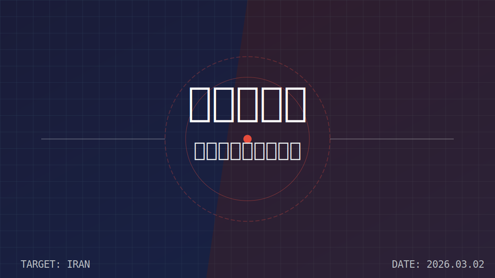

**2026年2月28日，历史被改写。**

美以联手对伊朗发动的雷霆一击，不仅仅是针对核设施的清除，更是对德黑兰政权的一次“斩首行动”。传闻最高领袖哈梅内伊生死未卜，霍尔木兹海峡被伊斯兰革命卫队（IRGC）封锁，全球油价应声暴涨。

这一切，仿佛是历史的回响。

从朝鲜半岛的冰天雪地，到越南的丛林，再到伊拉克的沙漠，二战后的美国一直在充当“世界警察”。但每一次介入，结局都大相径庭。

今天，我们不妨拨开战火的迷雾，通过复盘二战后美国介入的几次重大区域冲突，来推演这场美伊战争的最终走向。

---

### 一、 美国的战争剧本：从“遏制”到“改造”

二战后，美国的对外干预模式经历了几个明显的阶段。

#### 1. 意识形态的绞肉机：朝鲜与越南
在冷战初期，美国的介入逻辑非常简单——**“遏制”**。
*   **模式：** 大规模地面部队介入 + 长期消耗战。
*   **处理方式：** 扶持亲美政权，试图通过军事胜利来确立政治边界。
*   **结果：** 
    *   **朝鲜战争（1950-1953）：** 战平，划线而治。虽然保住了韩国，但付出了惨重代价。
    *   **越南战争（1955-1975）：** 彻底失败。美国陷入泥潭，国内反战情绪高涨，最终狼狈撤军。
*   **教训：** 美国意识到，仅靠军事力量无法战胜民族主义和游击战，且长期地面战争是国内政治的毒药。

#### 2. “外科手术”式的巅峰：海湾战争（1991）
这是美军的高光时刻，也是现代战争的教科书。
*   **模式：** 拥有绝对制空权 + 信息化作战 + 有限目标。
*   **处理方式：** 目标极其明确——把萨达姆赶出科威特，而不是推翻萨达姆政权。
*   **结果：** 完胜。以极小的代价达成了战略目标。
*   **处理关系：** 战后通过制裁和禁飞区遏制伊拉克，保持了地区势力的微妙平衡。

#### 3. “政权更迭”的泥潭：阿富汗与伊拉克（2001-2021）
911事件后，美国犯了战略性的错误——试图**“改造”**中东。
*   **模式：** 闪电战推翻政权 + 漫长的占领与重建。
*   **处理方式：** 解散原有军政结构，试图移植美式民主。
*   **结果：** 
    *   **军事上：** 迅速胜利，萨达姆和塔利班政权迅速倒台。
    *   **政治上：** 彻底失败。陷入治安战的汪洋大海，花费数万亿美元，最终塔利班卷土重来，伊拉克什叶派倒向伊朗。
*   **教训：** “打烂一个旧世界”很容易，“建设一个新世界”难如登天。美国选民对“国家建设（Nation Building）”彻底厌倦。

#### 4. “离岸平衡”与代理人战争：利比亚与叙利亚（2011至今）
吸取了伊拉克的教训，奥巴马时期转向了“幕后指挥”。
*   **模式：** 空中支援 + 地面代理人（反政府武装）。
*   **结果：** 卡扎菲倒台了，但利比亚陷入长期内战；叙利亚阿萨德政权在俄罗斯支持下挺过来了。美国没有陷入泥潭，但也没能掌控局势。

---

### 二、 2026的美伊战争：是“伊拉克2.0”还是“新模式”？

回到当下的美伊冲突。如果你仔细观察这次2026年2月28日的行动，你会发现它**既不是伊拉克战争的翻版，也不是利比亚模式的简单重复。**

#### 1. 不会是“伊拉克2.0”
特朗普总统（或当前执政者）非常清楚，美国民众绝不会支持派遣十万大军登陆伊朗。伊朗的国土面积、地形复杂度和人口规模远超伊拉克，地面入侵将是地狱级别的难度。
*   **判断：** 美军**绝对不会**寻求占领德黑兰，也不会在这个阶段派遣大规模地面部队进行长期驻扎。

#### 2. “斩首”+“内应”的新战法
这次冲突有一个极为特殊的背景——**2025年底开始的伊朗国内大爆发**。
这给了美国一个千载难逢的机会：**里应外合**。
*   **当前策略：** 
    *   **外部：** 美以空军利用代差优势，定点清除伊朗核设施、导弹基地和指挥中枢（斩首战术）。
    *   **内部：** 此时的空袭不再被视为“侵略”，而被部分反抗民众视为“支援”。美国试图复制利比亚模式，但这次依靠的是伊朗国内积压已久的民怨。

---

### 三、 终局推演：走向何方？

基于历史规律和当前局势，我们可以对这场冲突的走向做一个大胆的预测：

#### 1. 短期：极度混乱与油价飙升
霍尔木兹海峡的封锁是伊朗最后的底牌。短期内，波斯湾的油轮将成为导弹的靶子，全球供应链将经历剧痛。这是黎明前的至暗时刻。

#### 2. 中期：政权脆断，但无序并存
与萨达姆不同，伊朗神权政治的基础在于其宗教合法性和革命卫队的武力。一旦最高层被“物理清除”，且革命卫队在美军空袭和国内民众的夹击下分崩离析，德黑兰政权可能在数周甚至数天内发生**雪崩式坍塌**。

#### 3. 长期：美国“管杀不管埋”
这是最残酷的现实。吸取了伊拉克和阿富汗的教训，美国在达成“消除核威胁”和“推翻反美政权”的目标后，极大概率会选择**迅速抽身**。
美国不会花20年去重建伊朗。未来的伊朗，可能会经历一段长时间的各派系博弈甚至内战。美国只在乎两点：
1.  核武器没了。
2.  亲美或至少不反美的势力上台（哪怕是军政府）。

### 结语

历史不会简单的重复，但总是押着相同的韵脚。
美国在经历了半个世纪的试错后，终于找到了一种最冷酷、最高效、也最不负责任的战争方式：**利用对手的内部矛盾，通过高科技力量进行精确打击，达成目标后迅速撤离，留下一地鸡毛供后人评说。**

对于伊朗人民来说，这可能是通往自由的阵痛，也可能是跌入深渊的开始。而对于世界来说，我们要准备好迎接一个没有了“波斯雄狮”制衡，但也更加破碎的中东。

