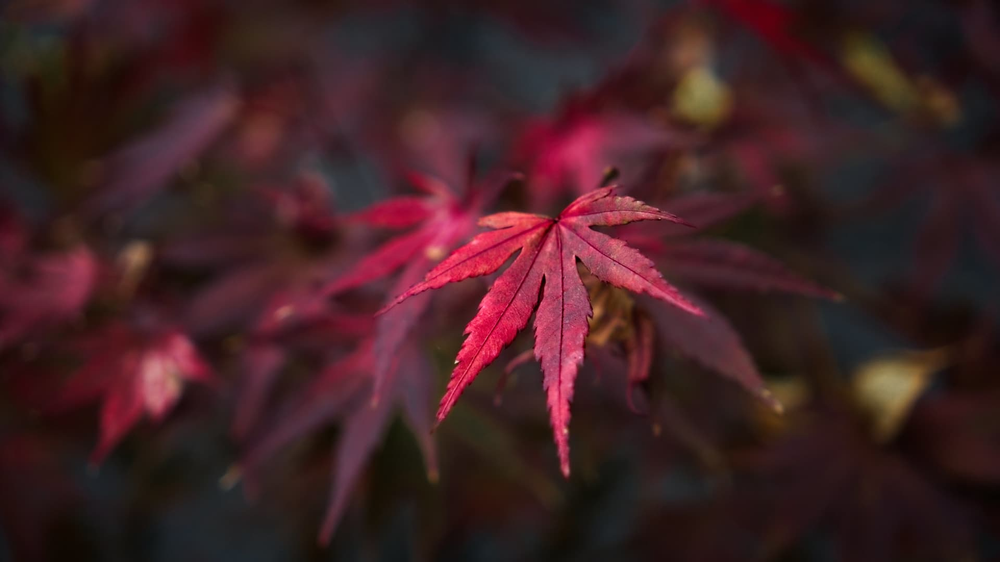

# 你的作品，能霸屏全球桌面10年吗？Ubuntu 26.04 壁纸大赛截稿在即！

> 📅 **截稿日期：** 2026年1月28日
> 🎨 **主题：** Resolute Raccoon（坚毅浣熊）
> 🏆 **奖励：** 成为 Ubuntu 26.04 LTS 默认壁纸之一，随系统分发至全球数千万设备

各位设计师、摄影师和开源爱好者们，

还记得我们前两天介绍的 **Ubuntu 26.04 LTS "坚毅浣熊"** 吗？这只将在今年4月登场的“干脆面君”，正在全网寻找它的“皮肤”！

**Ubuntu 26.04 壁纸大赛** 正在火热进行中，但请注意：**距离截稿只剩最后一周了！**

这不仅仅是一次普通的比赛。由于 Ubuntu 26.04 是 **LTS (长期支持版)**，这意味着入选的壁纸将伴随这个系统维护周期长达 5 年甚至 10 年（ESM）。你的作品，可能会出现在全球数千万开发者的屏幕上、云服务器的登录欢迎页里，甚至火星探测器的控制台上（如果有 GUI 的话 😉）。

---

## 🎨 三大参赛赛道

无论你是手绘大神、3D 渲染专家，还是风光摄影师，都有机会入选。本次大赛分为三个组别：

### 1. 🦝 吉祥物主题 (Mascot Theme)
这是“坚毅浣熊”的主场！
*   **要求：** 画面中必须包含“浣熊”元素。
*   **风格：** 可以是可爱的卡通风、极简的线条风，或者是赛博朋克风的机械浣熊。发挥你的想象力，重新定义这只“垃圾熊猫 (Trash Panda)”！

### 2. 💻 数字/抽象艺术 (Digital / Abstract)
*   **工具：** Blender, GIMP, Inkscape, Krita 等数字工具生成的艺术作品。
*   **风格：** 抽象的几何图形、流体艺术、光影渲染。这类壁纸通常最受开发者欢迎，因为它们不会干扰桌面的图标显示。

### 3. 📸 摄影作品 (Photography)
*   **内容：** 壮丽的自然风光、微距摄影、建筑几何。
*   **注意：** 避免出现可识别的人脸或受版权保护的商业品牌 logo。

---

## 📏 参赛规则划重点

为了避免你的神作被“技术性淘汰”，请务必遵守以下硬性指标：

1.  **原创性：** 必须是你自己的作品，严禁使用 AI 直接生成且未经人工显著处理的图像（社区对纯 AI 图争议较大，建议慎用或作为辅助）。
2.  **授权：** 作品必须遵循 **CC BY-SA 4.0** 或 **CC0** 协议。这意味着你同意让全世界免费使用、修改你的作品。
3.  **尺寸：**
    *   推荐分辨率：**3840 x 2160 (4K)**
    *   虽然不强制 4K，但在这个高分屏时代，画质越清晰越有优势。
4.  **无水印：** 提交的图片中不能包含你的个人水印、签名或文字。

---

## 🚀 如何提交？

*   **截止时间：** 2026 年 1 月 28 日 (UTC)
*   **结果公布：** 2026 年 2 月 4 日
*   **提交地址：** [Ubuntu Discourse 官方论坛](https://discourse.ubuntu.com/t/resolute-raccoon-26-04-wallpaper-competition/73131)

**操作指南：**
1.  注册/登录 Ubuntu Discourse 账号。
2.  在上述帖子下回复。
3.  上传你的作品（如果是大文件，建议压缩后上传预览图，并附上高清原图的外部链接）。
4.  注明作品名称和简单的创作理念。

---

## 💡 给参赛者的“作弊”建议

根据往年入选作品的风格，Ubuntu 官方评审团偏爱以下几类风格：
*   **紫色/橙色调：** 这是 Ubuntu 的品牌色。虽然不强制，但带有品牌色调的作品往往更容易与系统 UI 融合。
*   **简洁耐看：** 记住，这是壁纸，不是海报。过于复杂的画面会喧宾夺主，让人找不到桌面图标。
*   **动物元素巧妙融合：** 如果你画浣熊，试着把它融入几何图形中，而不是直接贴一张照片。

---

## 🖼️ 社区投稿抢先看

我们在官方论坛发现了一些优秀的早期投稿（来自用户 mendhak 等），大家感受一下这届选手的实力：

*(更多高清作品请前往 Discourse 论坛围观)*

---

## 🖼️ 历年经典回顾

*(此处建议插入一张历年 Ubuntu 经典壁纸的拼图，如 20.04 的Fossa, 22.04 的Jellyfish)*

机会难得，与其对着别人的壁纸羡慕，不如自己动手，让全球 Ubuntu 用户用上你的设计！

**你会参加吗？或者你最喜欢 Ubuntu 历史上的哪张壁纸？欢迎在评论区聊聊！**

---
*本文首发于公众号【UbuntuNews】，获取最新 Ubuntu 资讯与美化教程。*
