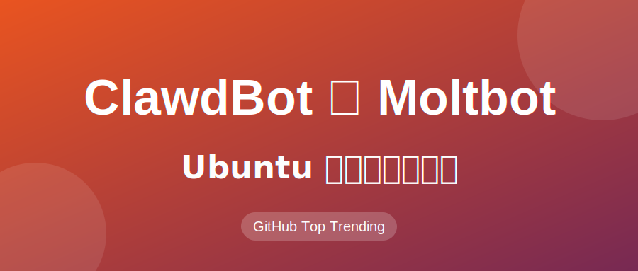

# ⚠️ClawdBot被迫改名Moltbot！这款GitHub爆火的AI员工，教你在Ubuntu上私有化部署

这两天，GitHub 上有一个项目杀疯了。

它叫 **ClawdBot**（现在已经更名为 **Moltbot**）。

就在昨天（1月27日），因为名字和 Anthropic 的 Claude 太像，被官方 "找上门" 了，于是作者 Peter Steinberger 连夜将其改名为 **Moltbot**（意为 "蜕皮/进化"）。

但这丝毫没有减弱它的热度。相反，这场 "改名风波" 让更多人关注到了这个 **"以隐私为核心、本地优先的 AI Agent"**。

很多朋友在后台问：**这到底是个什么东西？为什么突然这么火？我在 Ubuntu 上怎么玩？**

今天这篇文章，就带你一探究竟，并手把手教你在 Ubuntu 服务器（或本地机器）上部署一只属于你自己的 Moltbot。

---

## 🧐 到底什么是 Moltbot (原 ClawdBot)？

简单来说，Moltbot 是一个 **开源的、私有部署的个人 AI 助理**。

但它和我们平时用的 ChatGPT 或 Claude 网页版有本质区别：

1.  **它住在你的 IM 软件里**：你不需要打开特定的网页，直接在 **WhatsApp、Telegram、Discord** 甚至 iMessage 里和它聊天。
2.  **它拥有"身体"（权限）**：它不只是陪聊，它可以访问你的 **日历、邮件、本地文件**，甚至可以 **执行代码、浏览网页**。
3.  **它是"本地优先"的**：这是最核心的。它的"大脑"（LLM）可以是云端的（如 Claude API），也可以是本地的（如 Ollama），但它的 **记忆（Memory）** 和 **逻辑控制** 全部运行在你自己的服务器上。
    *   你的聊天记录、习惯偏好，都存在你自己的硬盘里，而不是大公司的云端。
4.  **它是"主动"的**：它不只是你问它答。它可以设定定时任务，比如 "每天早上8点把 Hacker News 的头条总结发给我"，或者 "监控我的服务器状态，有问题发消息报警"。

作者 Peter Steinberger 甚至把它形容为 **"你的第一个 AI 员工"**，而不是一个简单的聊天机器人。

---

## 🚀 为什么它突然爆火？

除了改名事件的推波助澜，Moltbot 切中了目前 AI 玩家的几个痛点：

*   **数据隐私焦虑**：不想把所有生活数据都喂给大模型公司。
*   **订阅制疲劳**：不想每个月给各种 AI 软件交钱，不如自己买个 API Key 或用本地模型，按需付费。
*   **Agent（智能体）的落地**：大家听 Agent 听腻了，但 Moltbot 是一个真正 **"开箱即用"** 且 **"极具实用性"** 的开源 Agent 框架。

---

## 🛠️ Ubuntu 部署实战教程

闲话少叙，作为 Ubuntu 玩家，我们当然要把它跑在自己的 Linux 环境上。

### 准备工作

*   **OS**: Ubuntu 24.04 LTS 或 26.04 LTS (Preview)
*   **配置**: 建议 2核 4G 起步（如果只做网关，不跑本地 LLM）；如果要跑本地 LLM (Ollama)，建议 16G 内存 + GPU。
*   **网络**: 需要能访问 GitHub 和 npm。

### 第一步：安装 Node.js 22

Moltbot 依赖较新的 Node.js 版本（推荐 v22）。我们使用 `nvm` 来安装。

```bash
# 1. 安装 nvm (如果已有可跳过)
curl -o- https://raw.githubusercontent.com/nvm-sh/nvm/v0.39.7/install.sh | bash

# 2. 重新加载 shell 配置
source ~/.bashrc

# 3. 安装 Node.js 22
nvm install 22
nvm use 22

# 验证版本
node -v
# 输出应为 v22.x.x
```

### 第二步：安装 Moltbot CLI

Moltbot 提供了一个非常方便的命令行工具。

```bash
# 全局安装 moltbot
npm install -g moltbot@latest

# 验证安装
moltbot --version
```

### 第三步：初始化与配置 (Onboarding)

这是 Moltbot 最人性化的地方，它提供了一个交互式的向导。

```bash
moltbot onboard --install-daemon
```

运行这个命令后，终端会进入交互模式，引导你完成以下步骤：

1.  **选择 LLM 提供商**：
    *   默认推荐 **Anthropic (Claude)**，因为 Moltbot 的很多 Prompt 是针对 Claude 优化的，效果最好。你需要填入 `sk-ant-...` 开头的 Key。
    *   也支持 **OpenAI** (GPT-4o) 或 **Ollama** (本地模型)。如果你想完全免费且隐私，选 Ollama（前提是你已经安装并运行了 Ollama）。
2.  **设置连接渠道 (Channels)**：
    *   **Telegram**: 最推荐。去 Telegram 找 `@BotFather` 申请一个 Bot Token 填进去即可。
    *   **WhatsApp**: 需要扫码登录，类似网页版微信。
3.  **安装系统服务**:
    *   因为我们加了 `--install-daemon` 参数，向导会自动帮你配置 `systemd` 服务，让 Moltbot 开机自启，并在后台运行。

### 第四步：验证运行

安装完成后，检查服务状态：

```bash
# 查看 Moltbot 服务状态
systemctl --user status moltbot

# 或者使用 CLI 查看日志
moltbot logs
```

如果一切正常，打开你配置的 Telegram Bot，对它说一句 `Hello`。

如果它回复了你，恭喜你！你的私人 AI 员工已经上线了！🎉

---

## 💡 进阶玩法

### 1. 让它写代码
Moltbot 内置了 Sandbox（沙箱），可以在你的服务器上安全地执行代码。
你可以对它说：
> "帮我写一个 Python 脚本，统计一下当前目录下的文件大小分布，并画个饼图发给我。"
它会直接写代码、运行、生成图片，然后把图片发给你！

### 2. 每日简报 (Cron Jobs)
你可以告诉它：
> "每天早上 9 点，搜索一下 'DeepSeek' 相关的最新技术新闻，总结成 300 字发给我。"
它就会默默记下这个任务，每天准时执行。

### 3. 连接本地知识库
如果你熟悉配置，还可以通过配置 `context` 让它读取你服务器上的特定文档目录，实现简易的 RAG（检索增强生成）。

---

## ⚠️ 注意事项

1.  **API 成本**：虽然 Moltbot 软件本身开源免费，但如果你使用 Anthropic 或 OpenAI 的 API，是需要按 Token 付费的。Moltbot 的记忆机制会消耗不少 Token，建议关注余额。
2.  **安全**：Moltbot 拥有你赋予它的权限。虽然它有沙箱机制，但**不要**在存有私钥或极度敏感数据的生产服务器上随意运行它，除非你完全清楚自己在做什么。建议使用单独的 VM 或 LXC 容器部署。

---

## 结语

从 ClawdBot 到 Moltbot，我们看到的不仅是一个改名闹剧，更是 **"AI 个人化"** 趋势的爆发。

在未来，也许我们每个人都不会直接面对冷冰冰的 ChatGPT 网页框，而是拥有一个熟悉我们习惯、住在我们聊天列表里、能帮我们真正干活的 **Moltbot**。

**趁周末，赶紧在你的 Ubuntu 上部署一个试试吧！**

---

*参考链接：*
*   *GitHub: https://github.com/moltbot/moltbot*
*   *Official Site: https://molt.bot*
