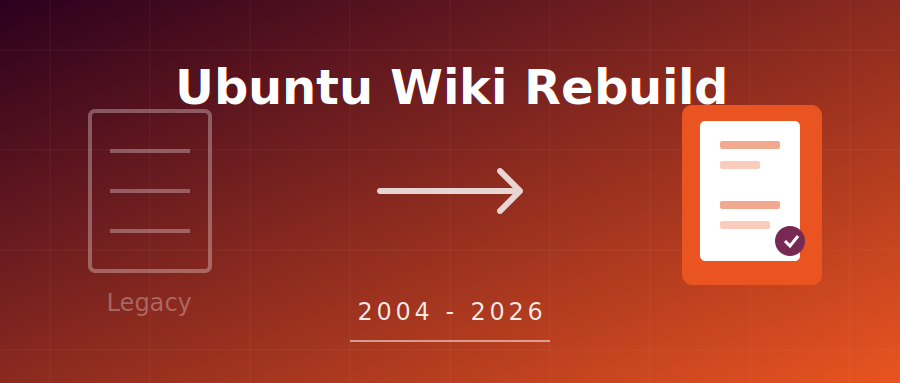

# 再见，MoinMoin！Ubuntu 宣布彻底重构 20 年历史的 Wiki 平台

对于许多 Ubuntu 老用户来说，`wiki.ubuntu.com` 和 `help.ubuntu.com/community` 是即使不常去，也倍感亲切的“老地方”。然而，Canonical 最近正式宣布，将在 **2026 年 8 月** 前逐步关闭这两个服务了 20 多年的公共 Wiki 平台，并推出一个完全重构的新平台。

这标志着一个时代的结束。从 2004 年 Ubuntu 第一个版本发布起，这些 Wiki 就一直伴随着社区成长。

为什么 Canonical 下定决心要推倒重来？根据最新披露的信息，主要原因集中在**技术债务**、**内容质量**和**用户体验**三个方面。

## 🛠️ 技术债：Python 2 与 MoinMoin 的绝唱

现有的 Ubuntu Wiki 构建在老旧的 **MoinMoin** 引擎之上，运行在早已停止支持的 **Python 2** 环境中。

这不仅是“旧”的问题，更是**安全**的问题。由于缺乏安全补丁，维护现有的 Wiki 平台让贡献者和用户都暴露在潜在的风险之下。Canonical 的技术团队在公告中坦言，这种架构已经无法适应现代 Web 的安全标准。

## 📚 内容腐烂：过时信息的温床

知名 Linux 媒体 **It's FOSS** 的编辑在报道此事时，也分享了自己的无奈经历：作为一名长期用户，他经常在寻找解决方案时“跌入”旧页面的陷阱，这些页面不仅没有帮助，反而因为过时的指令让问题变得更复杂。

这就是 Canonical 重点提到的 **“内容腐烂” (Content Decay)**。

随着 Ubuntu 官方文档 (Official Docs)、社区论坛 (Discourse) 的兴起，Wiki 的地位变得尴尬。许多页面年久失修，不仅信息过时，甚至与官方文档相互冲突。
*   **重复与冗余**：两个 Wiki 站点（主站和社区帮助站）内容重叠，用户不知道该信哪个。
*   **误导性**：过时的操作指南可能破坏现代系统的配置。

Canonical 认为，与其在一个摇摇欲坠的地基上修修补补，不如彻底清理，建立一个统一、权威的知识库。

## 🐌 体验崩塌：不仅是“丑”

除了内核的问题，现有的 Wiki 在**用户体验 (UX)** 上也完全掉队了：
*   **速度慢**：页面加载迟缓。
*   **登录损坏**：注册和登录流程经常出现问题。
*   **移动端噩梦**：在手机上浏览 Wiki 简直是一种折磨。
*   **UI 过时**：完全不符合现代 Web 的设计标准。

## 🚀 未来计划：2026 见

为了打造继任者，Canonical 已经组建了一支由**技术作者、平台工程师、社区工程师和设计师**组成的跨职能团队。

目前的计划是：
1.  **封闭开发**：新平台目前正在紧锣密鼓地闭门开发中。
2.  **Alpha 发布**：预计在 **2026 年** 推出 Alpha 版本供社区测试。
3.  **现代化标准**：新平台将采用现代化的文档标准、安全架构和用户体验设计。

## 💬 你的记忆

现有的 Wiki 承载了大量的历史讨论、社区治理文档和故障排除指南。Canonical 表示会迁移部分内容，归档部分内容，但也意味着许多旧资料可能会被永久遗留。

对于这个决定，你是感到惋惜，还是觉得“早该如此”？

**互动话题**：
> 你上一次访问 Ubuntu Wiki 是什么时候？有没有被上面的过时教程“坑”过的经历？欢迎在评论区分享你的故事！

---
*参考来源：The Arabian Post, Canonical Announcement*
