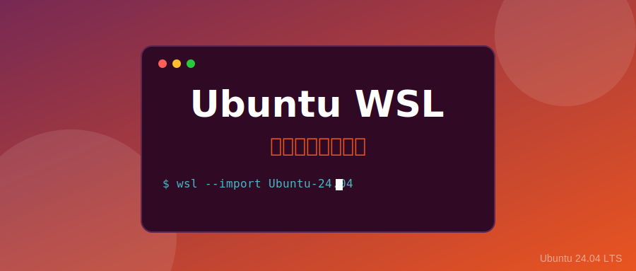

# 玩转 WSL：如何使用 Ubuntu 24.04 官方 WSL 镜像快速部署开发环境



对于在 Windows 环境下工作的开发者来说，**WSL (Windows Subsystem for Linux)** 已经是不可或缺的利器。通常我们习惯于从 Microsoft Store 一键安装 Ubuntu，但你是否知道，Canonical 官方现在为 Ubuntu 24.04 LTS (Noble Numbat) 提供了**专门针对 WSL 优化**的独立镜像？

通过官方镜像手动部署，不仅能让你摆脱应用商店的限制，还能自由指定安装路径（告别 C 盘空间焦虑），甚至可以轻松创建多个互不干扰的开发环境。

---

## 🚀 1. 为什么选择官方 WSL 镜像？

以往我们手动部署 WSL 时，通常使用的是通用的 Cloud Image 或 RootFS。而 Ubuntu 24.04 发布的 `wsl.rootfs.tar.gz` 镜像具有以下优势：

*   **体积精简**：去除了物理机或虚拟机所需的内核、驱动和冗余服务，专为 WSL 容器化环境设计。
*   **启动飞快**：由于镜像极其精简，冷启动速度相比标准版有显著提升。
*   **路径自由**：你可以将其安装在 D 盘、E 盘甚至移动硬盘上，彻底释放系统盘压力。
*   **环境隔离**：你可以基于同一个镜像导入为 `Ubuntu-Dev`、`Ubuntu-Test` 等多个实例，互不冲突。

---

## 🛠️ 2. 手把手教你部署官方镜像

### 第一步：获取镜像
目前 Ubuntu 官方提供两种渠道获取 WSL 专用镜像，你可以根据习惯选择：

#### 渠道一：Ubuntu Releases 站点（推荐）
这是 Ubuntu 的标准发布页面，提供最新的点版本（Point Release）镜像。
*   **下载地址**：[releases.ubuntu.com/noble/](https://releases.ubuntu.com/noble/)
*   **目标文件**：找到页面底部的 "WSL image"，文件名为 `ubuntu-24.04.x-wsl-amd64.wsl`。
    *   *注：`.wsl` 后缀文件本质上也是压缩包，可以直接用于导入。*

#### 渠道二：Ubuntu Cloud Images 站点
这是云镜像构建站点，提供每日构建（Daily Build）和发布版镜像，更新频率更高。
*   **下载地址**：[cloud-images.ubuntu.com/wsl/noble/current/](https://cloud-images.ubuntu.com/wsl/noble/current/)
*   **目标文件**：`ubuntu-noble-wsl-amd64-wsl.rootfs.tar.gz`

> **🤔 常见问题：.wsl 和 .rootfs.tar.gz 有什么区别？**
>
> *   **本质相同**：两者本质上都是包含完整 Linux 根文件系统的压缩包（Tarball），都可以被 `wsl --import` 命令直接识别和导入。
> *   **定位不同**：
>     *   `.wsl` 文件通常发布在 Ubuntu Releases 页面，代表经过充分测试的**稳定发布版**（Point Release）。
>     *   `.rootfs.tar.gz` 文件主要存在于 Cloud Images 站点，除了稳定版外，还包含最新的**每日构建版**（Daily Build），适合想要体验最新补丁的开发者。

### 第二步：准备安装目录
建议在非系统盘创建一个专用目录，例如：`D:\WSL\Ubuntu2404`。

### 第三步：使用命令行导入
打开 PowerShell（管理员权限），执行以下命令进行导入（请根据你下载的文件名调整命令）：

```powershell
# 格式：wsl --import <自定义发行版名称> <安装路径> <镜像文件路径>

# 如果你下载的是 .wsl 文件：
wsl --import Ubuntu-24.04 D:\WSL\Ubuntu2404 D:\Downloads\ubuntu-24.04.3-wsl-amd64.wsl

# 如果你下载的是 .rootfs.tar.gz 文件：
# wsl --import Ubuntu-24.04 D:\WSL\Ubuntu2404 D:\Downloads\ubuntu-noble-wsl-amd64-wsl.rootfs.tar.gz
```

### 第四步：首次启动与用户配置
导入完成后，执行 `wsl -d Ubuntu-24.04` 进入系统。

**注意**：手动导入的镜像默认以 `root` 用户登录。为了安全和方便，我们需要创建一个普通用户：

```bash
# 在 WSL 内部执行
NEW_USER="yourname"
useradd -m -G sudo -s /bin/bash $NEW_USER
passwd $NEW_USER

# 配置 WSL 默认以该用户登录
tee /etc/wsl.conf <<EOF
[user]
default=$NEW_USER
EOF
```

重启 WSL (`wsl --terminate Ubuntu-24.04`) 后再次进入，即可以普通用户身份登录。

---

## 💡 3. WSL 高效使用技巧

### 📁 1. 跨文件系统访问
*   **在 WSL 中访问 Windows**：路径为 `/mnt/c/`、`/mnt/d/` 等。
*   **在 Windows 中访问 WSL**：在资源管理器地址栏输入 `\\wsl$` 即可看到所有运行中的 Linux 根目录。

### 💻 2. 与 VS Code 完美结合
在 WSL 终端中直接输入 `code .`，即可启动 Windows 端的 VS Code 并自动安装远程开发插件。这让你能在 Windows 的流畅 UI 下，直接编辑 Linux 里的代码，享受极致的开发体验。

### 🌐 3. 网络与代理
WSL2 与宿主机共享网络协议栈，但在访问宿主机上的代理服务时，可能需要通过宿主机的 IP 地址。你可以通过 `cat /etc/resolv.conf` 查看宿主机的自动分配 IP。

### 💾 4. 备份与迁移
手动导入的另一个好处是备份极其简单：
```powershell
# 导出备份
wsl --export Ubuntu-24.04 D:\Backup\ubuntu_env.tar
# 以后随时可以在任何地方重新导入
```

### 🗑️ 5. 注销与删除环境
如果某个 WSL 实例不再需要，或者配置出错想要重头再来，可以使用注销命令将其彻底删除：

```powershell
# 警告：此操作会永久删除该实例及其包含的所有文件，且无法恢复！
wsl --unregister Ubuntu-24.04
```

执行后，该实例及其在 `D:\WSL\Ubuntu2404` 下的虚拟磁盘文件 (`ext4.vhdx`) 将被立即清除。

---

## 🌟 总结

Ubuntu 24.04 的官方 WSL 镜像为开发者提供了一个更加纯净、灵活的起点。无论你是想深度定制自己的开发环境，还是想更科学地管理磁盘空间，手动导入镜像都是进阶 WSL 玩家的必修课。

你还在用 Microsoft Store 安装 Ubuntu 吗？不妨尝试一下这种更硬核、更自由的方式！

---
**互动话题**：
> 你的 WSL 已经占用了多少 C 盘空间？你是否考虑过将它搬迁到其他盘符？欢迎在评论区分享你的 WSL 调优心得！
