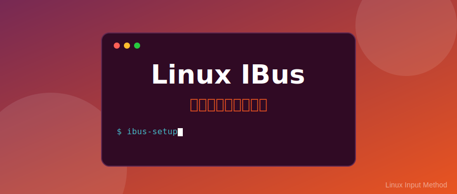

# IBus 输入法框架完全指南：从入门到精通



在 Linux 世界中，输入法一直是新手迁移的一大门槛。不同于 Windows/macOS 开箱即用的输入体验，Linux 的输入法系统由**输入法框架 (Framework)** 和**输入法引擎 (Engine)** 两部分组成。

**IBus (Intelligent Input Bus)** 是目前 GNOME 桌面环境及 Fedora、Ubuntu 等主流发行版的**默认输入法框架**。它与系统集成度极高，稳定性好，是大多数用户的首选。

本文将为你提供一份详尽的 IBus 使用指南，助你打造丝滑的中文输入体验。

---

## 1. 核心概念：小白必看

在开始之前，我们需要理清两个概念，防止在安装软件时“晕头转向”：

*   **输入法框架 (IMF)**：相当于“底座”或“总管”。它负责与操作系统交互，管理输入法的切换、UI 显示等。常见的有 **IBus** 和 **Fcitx5**。
*   **输入法引擎 (IME)**：相当于“插件”或“词库核心”。它负责具体的拼音、五笔、注音算法。例如 **Rime (中州韵)**、**Libpinyin (智能拼音)**。

> **形象比喻**：IBus 是游戏机主机，而 Rime 或 Libpinyin 是游戏卡带。你必须先有主机，插入卡带才能玩游戏。

---

## 2. 为什么选择 IBus？

虽然 Fcitx5 以其强大的自定义能力和皮肤系统备受推崇，但 IBus 依然有其不可替代的优势：

1.  **GNOME 原生集成**：在 Ubuntu/Fedora 的 GNOME 桌面中，IBus 是系统组件的一部分。它没有独立的托盘图标，而是直接集成在右上角的系统菜单中，视觉风格与系统完全一致。
2.  **Wayland 支持完善**：随着 Linux 桌面全面转向 Wayland 协议，IBus 作为 RedHat/GNOME 阵营的主力，对 Wayland 的兼容性通常优于其他框架。
3.  **开箱即用**：大多数发行版装完系统就能直接打字，无需额外折腾。

---

## 3. 各大发行版安装与启用

### 3.1 Ubuntu / Debian / Kali
Ubuntu 默认已经安装了 IBus。如果你需要重新安装或补充引擎：

```bash
# 安装框架及常用引擎（智能拼音、Rime、五笔）
sudo apt update
sudo apt install ibus ibus-libpinyin ibus-rime ibus-table-wubi
```

### 3.2 Fedora / CentOS / RHEL
Fedora 是 IBus 的大本营，默认集成度最高。

```bash
# 安装框架及增强组件
sudo dnf install ibus ibus-libpinyin ibus-rime ibus-typing-booster
```

### 3.3 Arch Linux / Manjaro
Arch 系用户需要手动安装并配置。

```bash
# 安装基础包
sudo pacman -S ibus ibus-libpinyin ibus-rime

# 建议安装配置工具
sudo pacman -S ibus-setup
```

### 3.4 关键步骤：启用 IBus
安装完成后，并非立即生效，你需要告诉系统“我要用 IBus”：

1.  **GNOME 桌面**：进入 **设置 (Settings)** -> **键盘 (Keyboard)** -> **输入源 (Input Sources)**，点击 `+` 号添加 `Chinese (Intelligent Pinyin)` 或 `Chinese (Rime)`。
2.  **非 GNOME 桌面 (KDE/XFCE 等)**：通常需要运行 `ibus-setup` 进行配置，或者在系统设置的“输入法”模块中选择 IBus。

---

## 4. 常用输入法引擎盘点与安装

IBus 拥有丰富的引擎生态，满足不同人群的需求。以下是几款最主流的引擎及其安装方式。

### 4.1 智能拼音 (Libpinyin) —— 经典首选
`ibus-libpinyin` 是最接近 Windows 自带拼音体验的引擎，也是大多数发行版的默认中文输入法。

*   **优点**：配置简单，支持云输入（部分版本），支持模糊音，纠错能力尚可。
*   **安装命令**：
    *   Ubuntu/Debian: `sudo apt install ibus-libpinyin`
    *   Fedora: `sudo dnf install ibus-libpinyin`
    *   Arch: `sudo pacman -S ibus-libpinyin`
*   **配置方法**：
    1.  打开终端输入 `ibus-setup` 或在 GNOME 设置中点击输入法旁边的“齿轮”图标。
    2.  **常用设置**：
        *   **Fuzzy Pinyin (模糊音)**：分不清 z/zh, c/ch, n/l 的南方用户必开。
        *   **Dictionary (词典)**：可以导入搜狗细胞词库（需转换格式），但较为繁琐。
        *   **Shortcuts (快捷键)**：建议将切换中英文改为 `Shift`（默认通常是 `Shift`）。

### 4.2 Rime (中州韵) —— 极客神器
`ibus-rime` 是 Rime 输入法在 IBus 上的实现。它以“高门槛、高上限”著称。

*   **安装命令**：
    *   Ubuntu/Debian: `sudo apt install ibus-rime`
    *   Fedora: `sudo dnf install ibus-rime`
    *   Arch: `sudo pacman -S ibus-rime`
*   **为什么用它？**：数据完全掌握在自己手中，隐私安全；配合**“雾凇拼音”**词库，体验超越大多数商业输入法。
*   **快速配置雾凇拼音 (Rime-Ice)**：
    Rime 默认的词库比较旧，强烈建议安装[雾凇拼音](https://github.com/iDvel/rime-ice)配置。

    ```bash
    # 1. 进入 Rime 用户配置目录
    cd ~/.config/ibus/rime/

    # 2. 备份原有配置 (可选)
    mkdir backup && mv * backup/

    # 3. 下载雾凇拼音 (需安装 git)
    git clone https://github.com/iDvel/rime-ice.git .
    
    # 4. 重新部署
    # 点击状态栏输入法图标 -> 部署 (Deploy)
    # 或者在终端运行：
    ibus-daemon -dr
    ```
    *注：`ibus-rime` 的用户目录通常在 `~/.config/ibus/rime`，部分发行版可能不同。*

### 4.3 五笔/仓颉 (IBus Table) —— 形码输入
如果你是五笔或仓颉用户，`ibus-table` 系列是你的不二之选。它基于码表工作，稳定高效。

*   **支持方案**：五笔 86/98、仓颉、郑码、行列等。
*   **安装命令**：
    *   Ubuntu/Debian: `sudo apt install ibus-table ibus-table-wubi ibus-table-cangjie`
    *   Fedora: `sudo dnf install ibus-table-chinese`
    *   Arch: `sudo pacman -S ibus-table`
*   **使用提示**：安装后需在 IBus 设置中添加具体的输入方案（如“五笔86”）。

### 4.4 酷音/注音 (Chewing/Libzhuyin) —— 繁体注音
对于习惯使用注音符号（Bopomofo）的用户，推荐使用 Chewing（酷音）或 Libzhuyin。

*   **安装命令**：
    *   Ubuntu/Debian: `sudo apt install ibus-chewing`
    *   Fedora: `sudo dnf install ibus-chewing`
    *   Arch: `sudo pacman -S ibus-chewing`

### 4.5 Typing Booster —— 英文与代码补全
这是一个强大的辅助工具，适合经常输入长英文单词或代码的用户。

*   **功能**：提供英文单词联想、emoji 表情搜索、甚至是文件路径补全。
*   **安装命令**：
    *   Ubuntu/Debian: `sudo apt install ibus-typing-booster`
    *   Fedora: `sudo dnf install ibus-typing-booster` (默认可能已安装)
    *   Arch: `yay -S ibus-typing-booster` (通常在 AUR 中)

---

## 5. 进阶技巧：解决痛点

### 5.1 解决快捷键冲突 (Ctrl+Space)
很多开发者习惯用 `Ctrl+Space` (控制+空格) 触发代码补全，但 IBus 默认会抢占这个快捷键用于切换输入法。

**解决方案**：
1.  打开终端运行 `ibus-setup`。
2.  进入 **General (常规)** 选项卡。
3.  找到 **Next input method (下一个输入法)**，删除 `Control+Space`，或者将其改为 `Super+Space` (Win键+空格)。
4.  **注意**：在 GNOME 桌面中，系统设置 (`gnome-control-center`) 的快捷键优先级高于 `ibus-setup`。如果上述无效，请去 **设置 -> 键盘 -> 键盘快捷键 -> 打字** 中修改“切换到下一个输入源”。

### 5.2 环境变量配置 (无法输入中文？)
在某些非 GNOME 环境或特定软件（如旧版 Qt 程序）中，可能无法调出输入法。这时需要手动设置环境变量。

编辑 `~/.bashrc` 或 `~/.xprofile`，加入以下内容：

```bash
export GTK_IM_MODULE=ibus
export QT_IM_MODULE=ibus
export XMODIFIERS=@im=ibus
```
注销并重新登录即可生效。

### 5.3 候选框不跟随光标
这是 Electron 应用（如 VS Code, Typora）或旧版 Java 应用常见的 Bug。
*   **VS Code**: 尝试在启动参数中加入 `--enable-wayland-ime` (如果是 Wayland 环境)。
*   **JetBrains IDE**: 确保安装了 `JBR` (JetBrains Runtime) 且启用了 IBus 支持插件。
*   **通用大招**：如果 Wayland 下问题严重，尝试在登录界面切换回 **Xorg** 会话。

---

## 6. 常见问题 (FAQ)

**Q: IBus 图标不见了怎么办？**
A: 尝试在终端重启 IBus 守护进程：
```bash
ibus-daemon -dr
```
`-d` 表示后台运行，`-r` 表示替换当前运行的实例。

**Q: 候选词全是方块？**
A: 这是字体缺失导致的。确保你安装了中文字体（如 Noto Sans CJK 或文泉驿）。
```bash
sudo apt install fonts-noto-cjk
fc-cache -fv
```

**Q: 如何美化 IBus 界面？**
A: GNOME 用户可以安装 **[Input Method Panel](https://extensions.gnome.org/extension/261/input-method-panel/)** 扩展，让输入法显示更符合现代审美。如果你使用 `ibus-rime`，还可以通过修改 Rime 的 `weasel.yaml` (Windows) 或 `ibus_rime.yaml` (Linux) 来自定义皮肤配色。

---

## 🌟 总结

IBus 凭借其原生级稳定性和广泛的兼容性，依然是 Linux 桌面的中流砥柱。
*   如果你追求**省心**：请使用 **IBus + Libpinyin**。
*   如果你追求**极致体验**：请使用 **IBus + Rime + 雾凇拼音**。

掌握了本文的技巧，你在 Linux 上的打字速度一定能起飞！

---

### 💬 互动话题

你在 Linux 上是用 IBus 还是 Fcitx5？有没有什么独家调教秘籍？欢迎在评论区分享你的 `default.custom.yaml` 配置！
