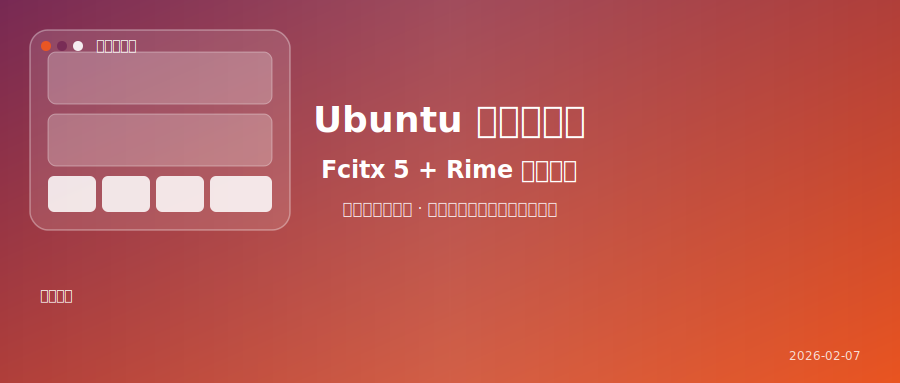

# 还在忍受 Ubuntu 默认输入法？手把手教你配置 Fcitx 5 + 雾凇拼音，打字体验飞升！



装好 Ubuntu，连上 WiFi，当你兴致勃勃地准备开始探索 Linux 世界时，却发现：**打字怎么这么别扭？**

默认的中文输入法词库匮乏、联想能力弱，甚至连个好看的皮肤都换不了。对于习惯了搜狗、微信键盘或者微软拼音的用户来说，这种落差感是巨大的。

别担心，这不是 Linux 的锅，只是你还没找到正确的打开方式。今天我们就来聊聊 Linux 输入法那些事，并带你打造一套**颜值与效率并存**的中文输入环境。

---

## 🧐 1. 科普：Linux 输入法江湖

在 Windows 或 macOS 上，输入法通常是一个独立的软件。但在 Linux 上，情况稍微复杂一点，我们有**输入法框架 (Input Method Framework)** 和**输入法引擎 (Input Method Engine)** 的概念。

你可以把“框架”想象成一个插座，而“引擎”就是插在上面的各种插头（拼音、五笔、注音等）。

目前 Ubuntu 上主要有两大门派：

### 🐢 守旧派：IBus (Intelligent Input Bus)
*   **地位**：Ubuntu 官方默认集成，GNOME 桌面环境的“亲儿子”。
*   **优点**：与系统集成度极高，开箱即用，稳定性好。
*   **缺点**：扩展性较差，自定义功能少，默认的“智能拼音”其实不太智能。
*   **现状**：如果你对打字要求不高，仅仅是偶尔搜个文件名，它也能凑合用。

### 🚀 革新派：Fcitx (Flexible Input Method Framework)
*   **地位**：社区最爱，目前主流版本是 **Fcitx 5**。
*   **优点**：轻量、低延迟、皮肤丰富、扩展性极强（支持 Lua 脚本）。
*   **缺点**：需要手动安装配置。
*   **现状**：**强烈推荐！** 它是目前 Linux 桌面体验最好的输入法框架，没有之一。

---

## 🛠️ 2. 保姆级教程：安装 Fcitx 5

接下来，我们将把 Ubuntu 默认的 IBus 替换为 Fcitx 5。

> **⚠️ 注意**：本教程适用于 Ubuntu 24.04 LTS 及 26.04 LTS。

### 第一步：补全中文语言包
有时候系统安装时没有联网，语言包可能不完整。
1.  打开 **Settings (设置)** -> **System (系统)** -> **Region & Language (区域与语言)**。
2.  点击 **Manage Installed Languages (管理已安装语言)**。
3.  如果系统提示 "The language support files... are not completely installed"，请点击 **Install** 补全。

### 第二步：安装 Fcitx 5 全家桶
打开终端 (`Ctrl + Alt + T`)，输入以下命令：

```bash
sudo apt update
sudo apt install fcitx5 \
                 fcitx5-chinese-addons \
                 fcitx5-frontend-gtk4 fcitx5-frontend-gtk3 fcitx5-frontend-qt5 \
                 kde-config-fcitx5
```

*   `fcitx5-chinese-addons`: 包含了拼音、也就是我们常说的“词库”支持。
*   `fcitx5-frontend-*`: 确保在各种软件里都能调出输入法。

### 第三步：切换输入法框架
1.  再次打开 **Manage Installed Languages** (或者在终端运行 `gnome-language-selector`)。
2.  找到底部的 **Keyboard input method system**。
3.  将默认的 `IBus` 改为 **`Fcitx 5`**。
4.  **关键步骤**：注销 (Log Out) 或重启电脑，让设置生效。

### 第四步：配置拼音
重启回来后，你应该能在右上角看到一个小键盘图标（如果没有，在终端运行 `fcitx5 -r` 启动）。

1.  右键点击右上角键盘图标 -> **Configure (配置)**。
2.  在右侧 **Current Input Method (当前输入法)** 列表中，确保包含：
    *   Keyboard - English (US)
    *   Pinyin
3.  如果没有 "Pinyin"，在左侧搜索栏搜 "Pinyin"，选中并点击中间的箭头添加到右侧。
4.  **快捷键**：默认切换键是 `Ctrl + Space`。你可以在 "Global Options" 里修改为习惯的 `Shift` 切换。

---

## 🎨 3. 进阶玩家：Rime + 雾凇拼音 = 极致体验

如果你觉得 Fcitx 5 自带的拼音还不够“懂你”，或者你担心隐私问题，不想用云输入法，那么 **Rime (中州韵)** 绝对是你的终极归宿。

而 **雾凇拼音 (Rime-Ice)** 则是目前 Rime 社区最火的配置方案，词库极其丰富，维护极其活跃。

### 安装 Rime 引擎
```bash
sudo apt install fcitx5-rime
```

### 部署雾凇拼音
1.  **下载配置**：前往 GitHub 下载雾凇拼音的配置文件（或者直接用 git clone）。
    ```bash
    # 这一步需要安装 git
    git clone https://github.com/iDvel/rime-ice.git ~/.local/share/fcitx5/rime/
    ```
    *(注：如果直接覆盖报错，请先备份原目录下的文件)*

2.  **启用 Rime**：
    *   打开 Fcitx 5 配置工具。
    *   添加输入法 "Rime"。
    *   在任务栏右键 Rime 图标 -> **Deploy (重新部署)**。

现在，你拥有了一个**无广告、不上传隐私、词库庞大且支持模糊音**的完美输入法。

---

## 🚧 4. 常见坑点与解决

### Q1: 在 Chrome/VS Code 里无法输入中文？
这通常是环境变量没生效。尝试在 `~/.bashrc` 或 `~/.xprofile` 文件末尾添加：

```bash
export GTK_IM_MODULE=fcitx
export QT_IM_MODULE=fcitx
export XMODIFIERS=@im=fcitx
```
保存后注销重登。

### Q2: Wayland 下候选框不跟随光标？
Ubuntu 默认使用 Wayland 显示协议，老旧应用可能存在兼容性问题。
*   **方法一**：在登录界面右下角齿轮，选择 "Ubuntu on Xorg"。
*   **方法二**：确保安装了 `fcitx5-wayland` 包（通常包含在 fcitx5 中）。

### Q3: 只有方块没有字？
这是字体缺失的问题。从 Windows 复制 `SimHei.ttf` (黑体) 或 `SimSun.ttc` (宋体) 到 `~/.local/share/fonts/`，然后运行 `fc-cache -fv` 即可。

---

## 🌟 总结

折腾输入法是每个 Linux 用户的必经之路。虽然过程稍微繁琐一点，但当你配好一套顺手的 Fcitx 5 + Rime 环境后，那种行云流水的打字快感，绝对值得你刚才付出的 10 分钟。

**从此，你的生产力工具不仅强大，而且顺手。**

---

### 💬 互动话题

> **你是“搜狗派”还是“Rime派”？**
>
> 在 Linux 上，你为了打字折腾过哪些输入法？有没有遇到过什么奇葩的 Bug（比如打着打着输入法消失了）？欢迎在评论区分享你的血泪史！👇
