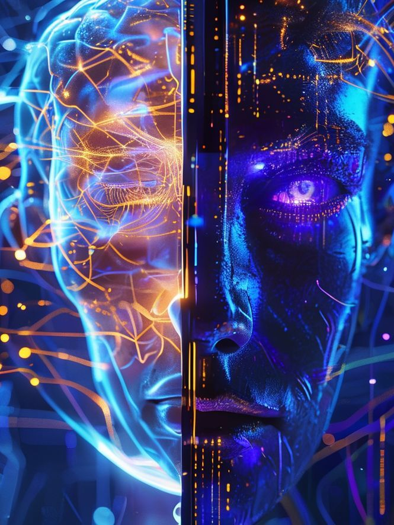
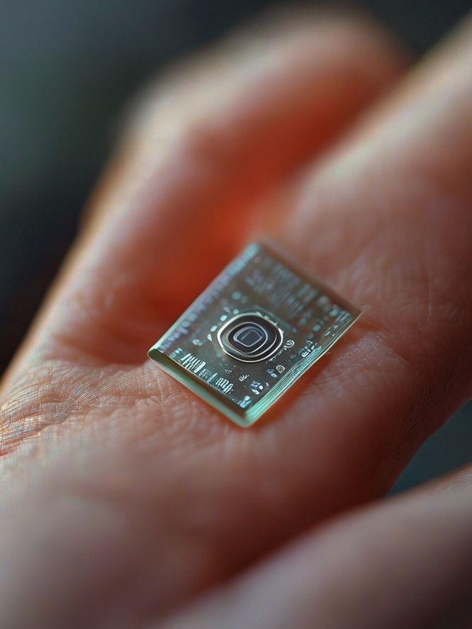

# 小红书发布文案：BISC 脑机接口芯片

> **发布时间**：2026-01-23
> **栏目**：🚨 AI新闻速递
> **状态**：待发布

---

## 1. 视觉方案 (Visuals)

### 封面图建议

*   **构图**：左侧为半透明的大脑3D模型，右侧放大的 BISC 芯片特写（突出“超薄”）。
*   **文案（大字）**：
    *   主标题：**脑机接口新革命！**
    *   副标题：**无线连接 + 不用开颅？**
*   **风格**：赛博朋克风，深蓝/紫配色，高对比度。

### 配图建议 (3-4张)
1.  **P2 - 尺寸对比**
    
    一张 BISC 芯片放在指尖或硬币旁的对比图，标注文本：“比头发丝还薄？”

2.  **P3 - 原理图解**
    
    简单的示意图，展示芯片如何通过无线信号连接电脑，不再需要头顶插线。

3.  **P4 - 应用场景**
    
    瘫痪患者通过意念控制机械臂或打字的模拟图。

4.  **P5 - 引导关注**：AI先锋名片，“关注我，看不一样的未来”。

---

## 2. 文案内容 (Copy)

**标题**：
马斯克Neuralink遇劲敌？🤯超薄BISC芯片问世，意念控制不再是梦！

**正文**：
家人们，2026年才刚开始，科技圈就炸了！💥
如果有天能用意念回微信、刷视频，你敢信吗？

最近，一款名为 **BISC** 的超薄神经植入物横空出世，简直是现实版《黑客帝国》！😱 跟它比起来，以前的脑机接口都显得太“笨重”了。

👉 **到底强在哪？**
✅ **超薄隐形**：它是单芯片设计，薄到几乎感觉不到，却集成了数万个电极！
✅ **无线连接**：彻底告别头顶“插管”，通过高带宽无线链路直连电脑。
✅ **超强算力**：内置先进AI模型，能实时解码你的运动意图和感知信号。

💡 **这意味着什么？**
以后瘫痪患者可能只需植入这个小芯片，就能流畅操作电脑、甚至重新站立行走！对于咱们普通人，也许未来真的能实现“意念打字”、“记忆上传”...🤔

科技发展的速度真的太快了，感觉科幻电影正在变成纪录片！🎥

💬 **如果技术成熟，你愿意尝试脑机接口吗？**
A. 必须冲，想体验赛博修仙！
B. 有点怕，万一被黑客入侵咋办？
评论区告诉我你的想法！👇

---
#AI先锋 #黑科技 #脑机接口 #BISC #未来科技 #AI新闻 #马斯克 #Neuralink #赛博朋克

---

## 3. AI绘画提示词 (Midjourney Prompts)

可以直接复制以下提示词到 Midjourney 生成配图：

### 封面图 (Cover)
> **Prompt**: `cyberpunk style, 3d render, split screen composition, left side: translucent glowing human brain model with delicate neural network connections, right side: extreme close-up macro shot of a ultra-thin futuristic transparent microchip BISC, glowing gold and blue circuits, deep blue and purple neon lighting, high contrast, 8k resolution, volumetric lighting, tech magazine cover style --ar 3:4 --v 6.0`

### P2 - 尺寸对比 (Size Comparison)
> **Prompt**: `macro photography, extreme close-up, a human fingertip holding a tiny transparent microchip, the chip is thinner than a hair strand, futuristic technology, depth of field, soft studio lighting, realistic texture, 8k resolution, high detail --ar 3:4 --v 6.0`

### P3 - 原理图解 (Schematic)
> **Prompt**: `futuristic schematic infographic style, minimalist 3d render, a human silhouette with a glowing chip in the brain, emitting blue wifi waves connecting to a computer server nearby, no wires, clean blue and white color scheme, data flow visualization, high tech interface --ar 3:4 --v 6.0`

### P4 - 应用场景 (Application)
> **Prompt**: `cinematic shot, a person sitting in a wheelchair focusing intensely, controlling a futuristic robotic arm with their mind, the robotic arm is pouring water into a glass, warm hope-filled lighting, futuristic medical facility background, shallow depth of field, photorealistic, 8k --ar 3:4 --v 6.0`
